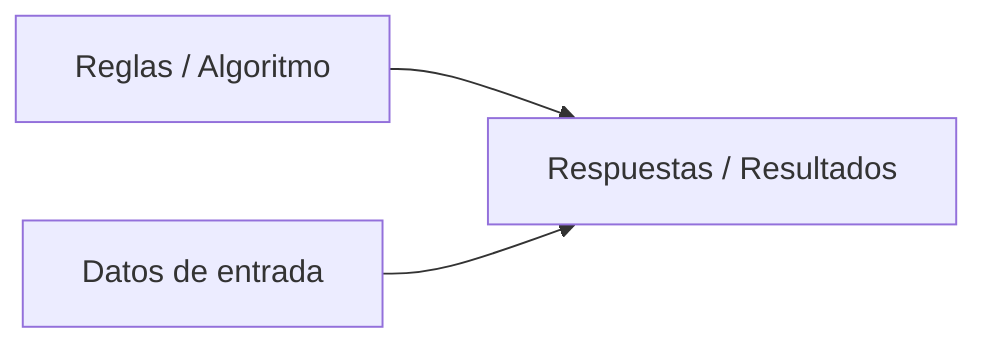
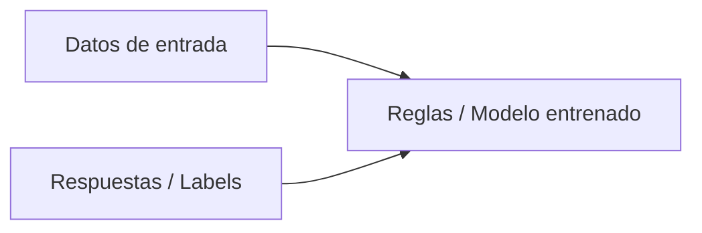
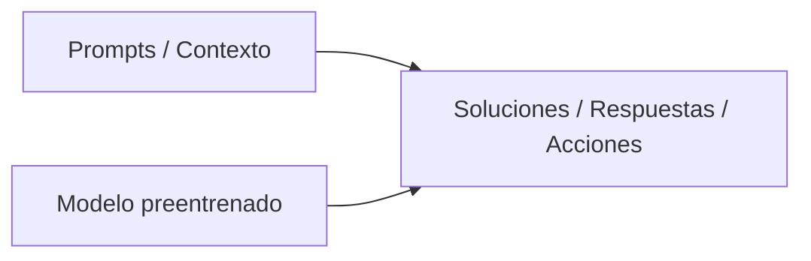

<!--
> [!abstract] El Desafío
> **Objetivo:** Descripción clara y directa en 1 o 2 líneas de lo que el alumnado debe construir o resolver al finalizar las 4 sesiones.
-->

> [!question] **A101(CE5) **
> **¿Qué se entrega?:** Informe técnico comparativo en formato Markdown/PDF sobre la evolución de paradigmas computacionales (Software 1.0, 2.0 y 3.0),
> 
>
---

# 1. Hitos de la IA
- [ ] Presentación del micro-reto en la pantalla interactiva ADI.
- [ ] Distribución de roles en la pareja (Ingeniería de Software / Ingeniería de Hardware/Diseño).
- [ ] Boceto en papel / pseudocódigo / diseño de bloques inicial.

## 1.1 La era exponencial

 La idea de la era exponencial se basa en que el ritmo del cambio tecnológico se acelera exponencialmente porque cada nueva generación de tecnología se construye sobre las capacidades de la anterior, haciéndola más poderosa y eficiente para crear la siguiente.

[

La inteligencia artificial (IA) se ha consolidado como una fuerza transformadora a nivel mundial, redefiniendo la sociedad, la economía y las relaciones geopolíticas. Su impacto es comparable al de revoluciones tecnológicas anteriores como la máquina de vapor o la electricidad, y está reconfigurando el panorama global a una velocidad sin precedentes.

De hecho, la IA se ha convertido en la fuerza motriz que está convirtiendo el progreso tecnológico en una curva exponencial, donde los avances se suceden a un ritmo cada vez más vertiginoso, dando lugar a lo que se conoce como **era exponencial**.
  
> [!info]- Hitos históricos de la computación
> 
> #### 1936 — La Máquina Universal de Turing
> Alan Turing publica *On Computable Numbers*, donde introduce el modelo teórico de la **Máquina de Turing**. Define formalmente los conceptos de algoritmo, estado y computabilidad, demostrando que una única máquina programable (universal) puede ejecutar cualquier cálculo matemático computable mediante la manipulación de símbolos discretos sobre una cinta infinita.
> 
> ---
> 
> #### 1945 — La arquitectura Von Neumann y los programas almacenados
> John von Neumann formaliza en el informe *First Draft of a Report on the EDVAC* la estructura base de los ordenadores modernos. Establece la separación entre la unidad central de procesamiento (ALU y registros), la unidad de control, los buses de entrada/salida y, de forma crucial, una **memoria unificada** que aloja tanto los datos como las instrucciones del programa, eliminando la necesidad de recablear físicamente las máquinas para cambiar de tarea (como ocurría en el ENIAC).
> 
> ---
> 
> #### 1947 - 1958 — Del transistor de estado sólido al circuito integrado
> La invención del **transistor bipolar** en Bell Labs (1947) por Bardeen, Brattain y Shockley sustituye a las válvulas de vacío, reduciendo drásticamente el consumo energético, el calor y el espacio físico. Posteriormente, en 1958-1959, Jack Kilby y Robert Noyce desarrollan de forma independiente el **circuito integrado**, permitiendo fabricar múltiples transistores, diodos y resistencias sobre una única pastilla de silicio mediante técnicas fotolitográficas.
> 
> ---
> 
> #### 1969 - 1973 — ARPANET y los cimientos del software moderno (Unix y C)
> Se establece la primera comunicación entre nodos de **ARPANET** mediante conmutación de paquetes, precursora directa de los protocolos TCP/IP formalizados por Cerf y Kahn. En paralelo, en los laboratorios Bell, Ken Thompson y Dennis Ritchie crean el sistema operativo **Unix** y el lenguaje de programación **C**, introduciendo la portabilidad entre diferentes arquitecturas de hardware, el diseño modular y el sistema de archivos jerárquico.
> 
> ---
> 
> #### 1971 - 1981 — El microprocesador y la computación personal
> Intel lanza el **4004** (1971), el primer microprocesador monolítico en un solo chip de silicio. Durante esta década, los experimentos de Xerox PARC con interfaces gráficas de usuario (GUI), ratón y programación orientada a objetos desembocan en la democratización del ordenador de escritorio con el lanzamiento del Apple II (1977), el IBM PC (1981) con arquitectura abierta y el Apple Macintosh (1984).
> 
> ---
> 
> #### 1989 - 1993 — La World Wide Web y el hipertexto global
> Tim Berners-Lee diseña en el CERN los protocolos **HTTP**, el lenguaje **HTML** y los identificadores de recursos (**URI/URL**). La posterior liberación del código al dominio público y el surgimiento de navegadores como NCSA Mosaic transforman la infraestructura técnica de Internet en una red de acceso universal a la información distribuida.
> 
> ---
> 
> #### 2006 - 2012 — Computación paralela masiva y el auge del Deep Learning
> Nvidia presenta la arquitectura **CUDA** (2006), permitiendo utilizar las unidades de procesamiento gráfico (GPU) para cálculo científico de propósito general (GPGPU). En 2012, la red neuronal convolucional **AlexNet** (Krizhevsky, Sutskever y Hinton) gana el desafío ImageNet por un margen histórico entrenándose sobre GPUs, demostrando la viabilidad del aprendizaje profundo (*deep learning*) a gran escala frente a los métodos clásicos de visión por computador.
> 
> ---
> 
> #### 2017 — La arquitectura Transformer y la atención sin recurrencia
> El equipo de investigación de Google publica *Attention Is All You Need*, introduciendo el **Transformer**. Al prescindir de las estructuras recurrentes (RNN) o convolucionales (CNN) y basarse exclusivamente en mecanismos de **autoatención** (*self-attention*), la arquitectura permite procesar secuencias de texto de forma totalmente paralelizable, optimizando el aprovechamiento del hardware acelerador (GPUs y TPUs) y eliminando el problema del desvanecimiento del gradiente en contextos largos.
> 
> ---
> 
> #### 2020 - Actualidad — Modelos de lenguaje a gran escala (LLMs) y capacidades emergentes
> La formulación empírica de las **leyes de escalado** (*scaling laws*) demuestra que aumentar exponencialmente los parámetros del modelo, los tokens de entrenamiento y la capacidad de cómputo genera saltos cualitativos predecibles. El despliegue de modelos fundacionales (familia GPT, Gemini, Llama, Claude) combinados con aprendizaje por refuerzo con retroalimentación humana (RLHF) consolida a los LLMs como plataformas de propósito general capaces de razonamiento simbólico, generación de código, traducción y procesamiento multimodal.

>[!question]- La reinvención de la Inteligencia Artificial. Ponencia de Nuria Oliver
> 
> 
>
>
> 1. ¿Cómo define la ponente la Inteligencia Artificial y cuál es su principal limitación inherente según esta definición? 
> 2. Explica la diferencia fundamental entre la Inteligencia Artificial específica y la Inteligencia Artificial general (AGI). ¿Se considera que necesitamos alcanzar la AGI para que la IA tenga un impacto significativo en la sociedad?
> 3. Describe brevemente las dos grandes escuelas de pensamiento que han existido históricamente en el campo de la Inteligencia Artificial. ¿Cuál de ellas predomina en la actualidad y por qué?
> 4. ¿Qué paralelismo establece la ponente entre la electricidad y la Inteligencia Artificial en el contexto de las revoluciones industriales? Menciona al menos dos similitudes.
> 5. ¿Cuáles son los tres factores principales que han impulsado el desarrollo exponencial de las técnicas de Inteligencia Artificial basadas en el aprendizaje a partir de datos desde 2012-2013?
> 6. Describe brevemente el concepto de redes neuronales profundas y su importancia en la revolución actual de la Inteligencia Artificial. Menciona algún ejemplo de su aplicación exitosa.
> 7. ¿Qué significa el término "Inteligencia Artificial generativa" y cuál es un ejemplo del impacto sin precedentes que ha tenido en comparación con otros servicios digitales?
> 8. Menciona al menos tres ámbitos de la vida cotidiana o de la sociedad en los que la Inteligencia Artificial tiene una presencia cada vez mayor.

### 1.2 ¿Los ordenadores piensan?
En las secciones anteriores se ha mencionado que la IA es una tecnología que permite a las máquinas imitar funciones cognitivas humanas como el aprendizaje y la resolución de problemas. Pero, ¿realmente los ordenadores piensan? Hagamos un breve repaso histórico.

La **Prueba de Turin** es un experimento concebido por Alan Touring en 1950, que buscaba responder a la pregunta: ¿Puede pensar una máquina?. En esencia la prueba consiste en que un evaluador humano interactúa con dos entidades, una máquina y un humano, a través de un terminal de ordenador. Si el evaluador no puede distinguir entre la máquina y el humano, entonces la máquina se considera que piensa.

La prueba de Turing no se centra en cómo la máquina piensa, sino en su capacidad para comportarse de manera indistinguible de un humano.

Esto significa que la máquina no necesita tener conciencia o comprensión real, sino simplemente la capacidad de generar respuestas convincentes.

**Logic Theorist**, concebido en 1956 se considera como el primer programa de IA y su objetivo era demostrar teoremas de lógica simbólia de manera automática. Logic Theorist utilizaba un enfoque de búsqueda heurística para resolver problemas de lógica proposicional. El programa generaba posibles soluciones a un problema y luego las evaluaba utilizando un conjunto de heurísticas para determinar su viabilidad.

Este programa fue pionero en demostrar que las computadoras podían no solo realizar cálculos matemáticos, sino también emular aspectos del pensamiento humano.

Frank Rosenblatt (1928–1971) fue un psicólogo estadounidense ampliamente reconocido como uno de los pioneros del *Deep Learning*. Su principal contribución fue el desarrollo del **Perceptrón**, un modelo de clasificación binaria basado en un [discriminador lineal](https://en.wikipedia.org/wiki/Linear_discriminant_analysis). Este modelo realiza predicciones combinando un algoritmo con los pesos asignados a las entradas, marcando un hito en el campo de las redes neuronales artificiales.

  
![[recursos/perceptron.png]]

En 1967 se desarrolló el **Perceptrón Mark 1**, el primer sistema de red neuronal diseñado para aprender mediante prueba y error. Este sistema estaba específicamente orientado a la clasificación de imágenes de 20x20 píxeles. Aunque inicialmente el Perceptrón generó grandes expectativas en el ámbito académico, pronto se descubrió que tenía limitaciones significativas, ya que no podía ser entrenado para reconocer patrones más complejos. Esto llevó a un estancamiento en el desarrollo de las redes neuronales durante varios años.

El Perceptrón Mark 1 contaba con una única capa, lo que lo hacía apto únicamente para aprender datos que pudieran ser separados linealmente. Las pruebas realizadas con este sistema se centraron en entrenarlo para diferenciar entre imágenes de hombres y mujeres. Para ello, se introdujeron cientos de fotografías de hombres y mujeres con diferentes estilos de cabello y maquillaje durante el proceso de entrenamiento. Una vez completado el entrenamiento, se evaluó su desempeño utilizando imágenes de rostros que no había visto previamente. El sistema logró clasificar con éxito si una imagen correspondía a un hombre o a una mujer con una alta tasa de acierto.

En el siguiente vídeo de la época se detalla el proceso.

En **1997** IBM desarrolló **Deep Blue**, un superordenador capaz de jugar al ajedrez a un nivel de competición. Deep Blue fue el primer sistema de IA en derrotar a un campeón mundial de ajedrez, Garry Kasparov, en una partida oficial. La victoria de Deep Blue marcó un hito en la historia de la IA y demostró que las máquinas podían superar a los humanos en tareas cognitivas complejas.

Deep Blue guardaba en su memoria millones de partidas disputadas desde el siglo XVI, cuando uno de los mejores ajedrecistas era el cura español Ruy López de Segura. Sobre esa base de datos, el programa podía calcular hasta 200 millones de jugadas... cada segundo.

**Su éxito se basó en gran medida en la "fuerza bruta"**, es decir, su capacidad para calcular millones de movimientos posibles por segundo.

[
 

En **2011**, otro sistema de IA de IBM, **Watson**, ganó el concurso de televisión estadounidense Jeopardy!, en el que los concursantes debían responder preguntas en forma de enunciado. Watson fue capaz de interpretar las preguntas en lenguaje natural y generar respuestas precisas en tiempo real. Su victoria en Jeopardy! demostró que las máquinas podían comprender y procesar el lenguaje humano de manera efectiva. ([[https://youtu.be/P18EdAKuC1U?si=LVvA2MbTuJCjgFnP|Watson and the Jeopardy! Challenge]])

En **2015**, Baidu (el google Chino), crea la supercomputadora **Minwa**, obtiene un nuevo récord en reconocimiento de imágenes superando la anterior marca de Google. Su procesamiento se basa en el concepto establecido hace décadas con el Perceptrón de Frank Rosenblatt, pero con una red de neuronas mucho más extensa y organizada en múltiples capas jerárquicas (***Deep Learning* - Aprendizaje Profundo**).
 
La supercomputadora utilizó 1,5 millones de imágenes etiquetadas en 1.000 categorías diferentes para entrenar sus sistemas. Esta base de datos se emplea para preparar a las máquinas para el reto, que consiste en clasificar 10.000 imágenes que el ordenador no ha visto antes ([Web ImageNet. Desafio de clasificación.](https://www.image-net.org/update-mar-11-2021.php)).

Una de las claves del éxito de la supercomputadora fue una técnica de software, que modificó 1,2 millones de las imágenes del entrenamiento, distorsionándolas, volteándolas o tocando el colorido, de manera que se convirtieron en 2.000 millones. Esto le permitió contar con una base de datos más variada

En **2016**, **AlphaGo**, un programa de IA desarrollado por DeepMind (una empresa de Google), derrotó al campeón mundial de Go, Lee Sedol, en una serie de partidas. El juego de Go es un juego de estrategia extremadamente complejo que ha sido considerado durante mucho tiempo como un desafío para la IA debido a su alta complejidad y al gran número de posibles movimientos.

AlphaGo combina el Deep Learning con el aprendizaje por refuerzo. El aprendizaje por refuerzo es una técnica en el que un agente (programa) interactúa con un entorno, y recibe recompensas por acciones correctas y penalizaciones por acciones incorrectas, lo que le permite aprender a maximizar las recompensas a lo largo del tiempo. Hay que entender las recompesas como un valor numérico que guía al agente en la toma de decisiones. Por ejemplo, en  programa que juega ajedrez recibe una recompensa alta al capturar la reina del oponente y una recompensa aún mayor al dar jaque mate.

AlphaGo fue entrenado utilizando una combinación de datos de partidas de Go de jugadores humanos y partidas simuladas por el propio programa. Durante el entrenamiento, AlphaGo jugó millones de partidas contra sí mismo, lo que le permitió mejorar su capacidad de anticipación y toma de decisiones. La victoria de AlphaGo sobre Lee Sedol fue un hito significativo en el desarrollo de la IA y demostró que las máquinas podían superar a los humanos en tareas cognitivas complejas.

 

En **2017** se presenta **AlphaGo Zero**. A diferencia de las versión anterior de AlphaGo, AlphaGo Zero aprendió a jugar al Go únicamente a partir de las reglas del juego, no necesitó estudiar partidas humanas (aprendizaje supervisado).

Tras entrenarse jugando contra sí mismo, en tan solo 3 días,los resultados fueron sorprendentes, AlphaGo Zero superó con creces el nivel de juego de los mejores jugadores humanos y barrió a la vesión predecesora, que había vencido al campeón Lee Sedol.

# 2. Evolución de los paradigmas computacionales
### Software 1.0

Es la computación clásica *artesanal*. Un programador analiza un problema, **descompone la lógica en pasos algorítmicos** discretos (instrucciones finitas, concretas y numerables, paso1, paso2, paso3) y codifica explícitamente las reglas en un lenguaje de programación (`C, Python, Java, JavaScript`). El ordenador procesa los datos de entrada siguiendo esas instrucciones. 
Si el programa no considera determinados casos de entrada (*casos borde*), el programa falla.

### Software 2.0

Termino utilizado para definir el paradigma del ***Machine Learning*** y ***Deep Learning***. El programador no escribe la lógica interna paso a paso; en su lugar alimenta una red neuronal con conjuntos masivos de datos (datos de entrada) y sus resultados esperados, el ordenador u ordenadores infiere y optimiza millones de pesos/parámetros internos que constituyen el "código" o regla de decisión.

### Software 3.0

Representa la era de los **modelos fundacionales[^1]** (LLMs, multimodales) y la programación contextual o agéntica. No se programa desde cero como en el paradigma 1.0, ni se entrena un modelo completo con millones de entradas de pares entrada-salida (2.0). Se toma un modelo base ya preentrenado y generalista, y se "programa" en lenguaje natural o estructurado mediante *prompting*, técnicas de contexto y llamadas a herramientas/APIs. **El foco del desarrollador cambia de la implementación sintáctica a:** 
- Estructuración de prompts: Definir lores, restricciones de formato, instrucciones y ejemplos guiados.
- RAG(*Retrieval-Augmented Generation*): Diseñar conexiones de los modelos para buscar información en bases de datos e inyectarla dinámicamente en el contexto del modelo en tiempo de ejecución.
- Gestión de la ventana de contexto: Decidir qué fragmentos de información, memoria de conversación o documentación deben priorizarse dentro del límite de *Tokens*
[^1]: Termino (popularizado por la Universidad de Stanford en 2021) define a los modelos de IA de gran escala entrenados con volúmenes masivos de datos diversos (texto, código, audio, imágenes) mediante de aplicaciones distintas.
# Sesión 2: 
- [ ] Montaje de la estructura básica del código o hardware.
- [ ] Primer hito funcional de la misión.

# Sesión 3: 
- [ ] Integración de mecánicas avanzadas, condiciones o sensores.
- [ ] Pruebas intermedias de funcionamiento.

# Sesión 4: 
- [ ] Integración de mecánicas avanzadas, condiciones o sensores.
- [ ] Pruebas intermedias de funcionamiento.

# Sesión 5: 
- [ ] Integración de mecánicas avanzadas, condiciones o sensores.
- [ ] Pruebas intermedias de funcionamiento.

# Sesión 6: 
- [ ] Integración de mecánicas avanzadas, condiciones o sensores.
- [ ] Pruebas intermedias de funcionamiento.

# Sesión 7: 
- [ ] Integración de mecánicas avanzadas, condiciones o sensores.
- [ ] Pruebas intermedias de funcionamiento.

# Sesión 8: 
- [ ] Integración de mecánicas avanzadas, condiciones o sensores.
- [ ] Pruebas intermedias de funcionamiento.
---

