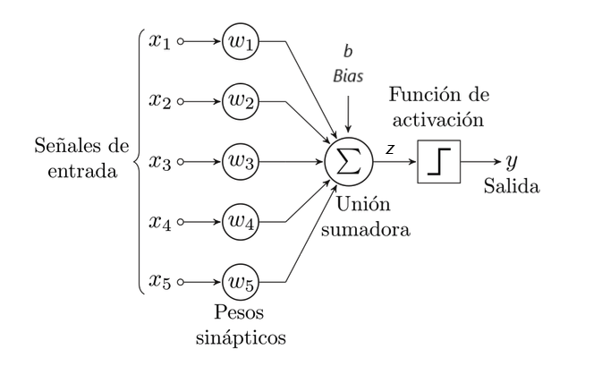

<!--
## Saberes básicos

- Representación de problemas mediante el modelado de la realidad
- Abstracción, secuenciación, algorítmica.Detección y generalización de patrones. 
- Sostenibilidad e inclusión como requisitos del diseño del software.
- Lenguajes de programación. Paradigmas de programación. Objetos y eventos.
- Lenguajes compilados e interpretados.
- Instalación y uso de entornos de desarrollo. Funcionalidades.
- Importancia de la computación en el desarrollo igualitario de la sociedad. Sesgos en los algoritmos
- Implicaciones éticas del Big Data y la Inteligencia Artificial.
- Comunidades de desarrollo de sw. libre.

-->

## 1. La era exponencial

La inteligencia artificial (IA) se ha consolidado como una fuerza transformadora a nivel mundial, redefiniendo la sociedad, la economía y las relaciones geopolíticas. Su impacto es comparable al de revoluciones tecnológicas anteriores como la máquina de vapor o la electricidad, y está reconfigurando el panorama global a una velocidad sin precedentes.

De hecho, la IA se ha convertido en la fuerza motriz que está convirtiendo el progreso tecnológico en una curva exponencial, donde los avances se suceden a un ritmo cada vez más vertiginoso, dando lugar a lo que se conoce como **era exponencial**.

La idea de la era exponencial[^1] se basa en que el ritmo del cambio tecnológico se acelera exponencialmente porque cada nueva generación de tecnología se construye sobre las capacidades de la anterior, haciéndola más poderosa y eficiente para crear la siguiente. La IA es el ejemplo más claro, ya que es una tecnología que se utiliza para mejorar y acelerar su propio desarrollo.

!!! info "Hitos históricos correspondientes a los avances más significativos de la Historia"
    A continuación se presentan algunos hitos históricos que ilustran cómo los avances más significativos en la historia de la humanidad han ido acortando progresivamente el tiempo necesario para alcanzar el siguiente gran logro. Esta aceleración evidencia el concepto de progreso exponencial: de millones de años entre innovaciones en la prehistoria, hemos pasado a milenios, siglos, décadas e incluso menos tiempo en la actualidad.

    - **~2.5 millones de años atrás:**  
        *Primeras herramientas de piedra (Industria Olduvayense). Inicio de la tecnología rudimentaria.*  
        Tiempo desde el hito anterior: N/A (punto de partida).

    - **~10,000 a.C. (hace ~12,000 años):**  
        *Revolución Neolítica. Domesticación de plantas y animales, inicio de la agricultura y los asentamientos permanentes.*  
        Tiempo desde el hito anterior: ~2.49 millones de años.

    - **~3,500 a.C. (hace ~5,500 años):**  
        *Invención de la escritura (Sumeria). Permite registrar y transmitir conocimiento de forma compleja.*  
        Tiempo desde el hito anterior: ~6,500 años.

    - **~1440 d.C. (hace ~585 años):**  
        *Imprenta de tipos móviles (Gutenberg). Revoluciona la difusión del conocimiento.*  
        Tiempo desde el hito anterior: ~4,940 años.

    - **~1760 d.C. (hace ~265 años):**  
        *Primera Revolución Industrial. Uso de la máquina de vapor y mecanización de la producción.*  
        Tiempo desde el hito anterior: ~320 años.

    - **~1903 d.C. (hace ~122 años):**  
        *Primer vuelo controlado y sostenido (Hermanos Wright). Inicio de la era de la aviación.*  
        Tiempo desde el hito anterior: ~143 años.

    - **~1945 d.C. (hace ~80 años):**  
        *Desarrollo de la energía atómica y aparición de los primeros computadores electrónicos programables (ENIAC). Inicio de la era digital y nuclear.*  
        Tiempo desde el hito anterior: ~42 años.

    - **~1969 d.C. (hace ~56 años):**  
        *Llegada del ser humano a la Luna y creación de ARPANET, precursora de Internet.*  
        Tiempo desde el hito anterior: ~24 años.

    - **~1991 d.C. (hace ~34 años):**  
        *La World Wide Web se hace accesible al público. Internet transforma la comunicación y el acceso a la información.*  
        Tiempo desde el hito anterior: ~22 años.

    - **~2007 d.C. (hace ~18 años):**  
        *Lanzamiento del primer iPhone. Popularización masiva de los smartphones y el internet móvil.*  
        Tiempo desde el hito anterior: ~16 años.

    - **~2012 d.C. - Presente (hace ~13 años - actualidad):**  
        *Revolución de la Inteligencia Artificial. Avances exponenciales en machine learning y deep learning que impactan múltiples campos.*  
        Tiempo desde el hito anterior: Solo ~5 años después del auge de los smartphones, y sigue acelerándose.

    Como se observa, el intervalo entre grandes revoluciones tecnológicas y sociales se ha reducido de manera espectacular, reflejando la aceleración del progreso en la era exponencial.

La IA representa un cambio de paradigma porque transforma lo que significa ser humano en una sociedad tecnológica: ya no se trata solo de hacer más rápido o con menos esfuerzo, sino de colaborar con máquinas que piensan y aprenden, llevando la creatividad, la eficiencia y los retos sociales y éticos a un nuevo nivel.

!!! question "AE101 - Relevancia de la IA en la actualidad"

    A partir de la siguiente [ponencia de Nuria Oliver, experta en IA y directora de la fundación Ellis](https://www.youtube.com/watch?v=DsN4mVFPkzM&list=PLaHkJt6iSQMlyeIsGIKesnRsVDxYIhUXf&index=3), responde a las siguientes cuestiones:

    1. ¿Cómo define la ponente la Inteligencia Artificial y cuál es su principal limitación inherente según esta definición?
    2. Explica la diferencia fundamental entre la Inteligencia Artificial específica y la Inteligencia Artificial general (AGI). ¿Se considera que necesitamos alcanzar la AGI para que la IA tenga un impacto significativo en la sociedad?
    3. Describe brevemente las dos grandes escuelas de pensamiento que han existido históricamente en el campo de la Inteligencia Artificial. ¿Cuál de ellas predomina en la actualidad y por qué?
    4. ¿Qué paralelismo establece la ponente entre la electricidad y la Inteligencia Artificial en el contexto de las revoluciones industriales? Menciona al menos dos similitudes.
    5. ¿Cuáles son los tres factores principales que han impulsado el desarrollo exponencial de las técnicas de Inteligencia Artificial basadas en el aprendizaje a partir de datos desde 2012-2013?
    6. Describe brevemente el concepto de redes neuronales profundas y su importancia en la revolución actual de la Inteligencia Artificial. Menciona algún ejemplo de su aplicación exitosa.
    7. ¿Qué significa el término "Inteligencia Artificial generativa" y cuál es un ejemplo del impacto sin precedentes que ha tenido en comparación con otros servicios digitales?
    8. Menciona al menos tres ámbitos de la vida cotidiana o de la sociedad en los que la Inteligencia Artificial tiene una presencia cada vez mayor.

## 2. ¿Los ordenadores piensan?

La **Prueba de Turin** es un experimento concebido por Alan Touring en 1950, que buscaba responder a la pregunta: ¿Puede pensar una máquina?. En esencia la prueba consiste en que un evaluador humano interactúa con dos entidades, una máquina y un humano, a través de un terminal de ordenador. Si el evaluador no puede distinguir entre la máquina y el humano, entonces la máquina se considera que piensa.

La prueba de Turing no se centra en cómo la máquina piensa, sino en su capacidad para comportarse de manera indistinguible de un humano.

Esto significa que la máquina no necesita tener conciencia o comprensión real, sino simplemente la capacidad de generar respuestas convincentes.

**Logic Theorist**, concebido en 1956 se considera como el primer programa de IA y su objetivo era demostrar teoremas de lógica simbólia de manera automática. Logic Theorist utilizaba un enfoque de búsqueda heurística para resolver problemas de lógica proposicional. El programa generaba posibles soluciones a un problema y luego las evaluaba utilizando un conjunto de heurísticas para determinar su viabilidad.

El Logic Theorist fue capaz de demostrar 38 de los primeros 52 teoremas en ["Principia Mathematica"](https://www.miguelangelvargascruz.com/principiamathematicavol1whiteheadrussell_blog_3224.html).

Este programa fue pionero en demostrar que las computadoras podían no solo realizar cálculos matemáticos, sino también emular aspectos del pensamiento humano.

Frank Rosenblatt (1928–1971) fue un psicólogo estadounidense ampliamente reconocido como uno de los pioneros del *Deep Learning*. Su principal contribución fue el desarrollo del **Perceptrón**, un modelo de clasificación binaria basado en un [discriminador lineal](https://en.wikipedia.org/wiki/Linear_discriminant_analysis). Este modelo realiza predicciones combinando un algoritmo con los pesos asignados a las entradas, marcando un hito en el campo de las redes neuronales artificiales.

En 1967 se desarrolló el **Perceptrón Mark 1**, el primer sistema de red neuronal diseñado para aprender mediante prueba y error. Este sistema estaba específicamente orientado a la clasificación de imágenes de 20x20 píxeles. Aunque inicialmente el Perceptrón generó grandes expectativas en el ámbito académico, pronto se descubrió que tenía limitaciones significativas, ya que no podía ser entrenado para reconocer patrones más complejos. Esto llevó a un estancamiento en el desarrollo de las redes neuronales durante varios años.

El Perceptrón Mark 1 contaba con una única capa, lo que lo hacía apto únicamente para aprender datos que pudieran ser separados linealmente. Las pruebas realizadas con este sistema se centraron en entrenarlo para diferenciar entre imágenes de hombres y mujeres. Para ello, se introdujeron cientos de fotografías de hombres y mujeres con diferentes estilos de cabello y maquillaje durante el proceso de entrenamiento. Una vez completado el entrenamiento, se evaluó su desempeño utilizando imágenes de rostros que no había visto previamente. El sistema logró clasificar con éxito si una imagen correspondía a un hombre o a una mujer con una alta tasa de acierto.

En el siguiente vídeo de la época se detalla el proceso: [Perceptron Mark 1](https://www.youtube.com/watch?v=cNxadbrN_aI).

En **1997** IBM desarrolló **Deep Blue**, un superordenador capaz de jugar al ajedrez a un nivel de competición. Deep Blue fue el primer sistema de IA en derrotar a un campeón mundial de ajedrez, Garry Kasparov, en una partida oficial. La victoria de Deep Blue marcó un hito en la historia de la IA y demostró que las máquinas podían superar a los humanos en tareas cognitivas complejas.

Deep Blue guardaba en su memoria millones de partidas disputadas desde el siglo XVI, cuando uno de los mejores ajedrecistas era el cura español Ruy López de Segura. Sobre esa base de datos, el programa podía calcular hasta 200 millones de jugadas... cada segundo.

Su éxito se basó en gran medida en la "fuerza bruta", es decir, su capacidad para calcular millones de movimientos posibles por segundo. [Video](https://youtu.be/KF6sLCeBj0s?si=iCIQTKFveK605T5r)

En **2011**, otro sistema de IA de IBM, **Watson**, ganó el concurso de televisión estadounidense Jeopardy!, en el que los concursantes debían responder preguntas en forma de enunciado. Watson fue capaz de interpretar las preguntas en lenguaje natural y generar respuestas precisas en tiempo real. Su victoria en Jeopardy! demostró que las máquinas podían comprender y procesar el lenguaje humano de manera efectiva [Video](https://youtu.be/P18EdAKuC1U?si=E9ysOoFUjz-X3hK4)

En **2015**, Baidu (el google Chino), crea la supercomputadora **Minwa**, obtiene un nuevo récord en reconocimiento de imágenes superando la anterior marca de Google. Su procesamiento se basa en el concepto establecido hace décadas con el Perceptrón de Frank Rosenblatt, pero con una red de neuronas mucho más extensa y organizada en múltiples capas jerárquicas (*Deep Learning* - Aprendizaje Profundo).

La supercomputadora utilizó 1,5 millones de imágenes etiquetadas en 1.000 categorías diferentes para entrenar sus sistemas. Esta base de datos se emplea para preparar a las máquinas para el reto, que consiste en clasificar 10.000 imágenes que el ordenador no ha visto antes.[Web ImageNet. Desafio de clasificación.](https://www.image-net.org/update-mar-11-2021.php)

Una de las claves del éxito de la supercomputadora fue una técnica de software, que modificó 1,2 millones de las imágenes del entrenamiento, distorsionándolas, volteándolas o tocando el colorido, de manera que se convirtieron en 2.000 millones. Esto le permitió contar con una base de datos más variada

En **2016**, **AlphaGo**, un programa de IA desarrollado por DeepMind (una empresa de Google), derrotó al campeón mundial de Go, Lee Sedol, en una serie de partidas. El juego de Go es un juego de estrategia extremadamente complejo que ha sido considerado durante mucho tiempo como un desafío para la IA debido a su alta complejidad y al gran número de posibles movimientos.

AlphaGo combina el Deep Learning con el aprendizaje por refuerzo. El aprendizaje por refuerzo es una técnica en el que un agente (programa) interactúa con un entorno, y recibe recompensas por acciones correctas y penalizaciones por acciones incorrectas, lo que le permite aprender a maximizar las recompensas a lo largo del tiempo. Hay que entender las recompesas como un valor numérico que guía al agente en la toma de decisiones. Por ejemplo, en  programa que juega ajedrez recibe una recompensa alta al capturar la reina del oponente y una recompensa aún mayor al dar jaque mate.

AlphaGo fue entrenado utilizando una combinación de datos de partidas de Go de jugadores humanos y partidas simuladas por el propio programa. Durante el entrenamiento, AlphaGo jugó millones de partidas contra sí mismo, lo que le permitió mejorar su capacidad de anticipación y toma de decisiones. La victoria de AlphaGo sobre Lee Sedol fue un hito significativo en el desarrollo de la IA y demostró que las máquinas podían superar a los humanos en tareas cognitivas complejas. [Enlace documental AlphaGo.](https://youtu.be/WXuK6gekU1Y?si=kRVI5afC1FLJagzh)

En **2017** se presenta **AlphaGo Zero**. A diferencia de las versión anterior de AlphaGo, AlphaGo Zero aprendió a jugar al Go únicamente a partir de las reglas del juego, no necesitó estudiar partidas humanas (aprendizaje supervisado).

Tras entrenarse jugando contra sí mismo, en tan solo 3 días,los resultados fueron sorprendentes, AlphaGo Zero superó con creces el nivel de juego de los mejores jugadores humanos y barrió a la vesión predecesora, que había vencido al campeón Lee Sedol. [Enlace Alphago Zero.](https://youtu.be/tCpf5wDr0UE?si=x3HmH2clBK66-dkF)

## 3. Definición de IA

## 4. La importancia de los datos

## Referencias

[^1]: [La era exponencial - Artículo web Hipermediaciones. Carlos A. Scolari](https://hipermediaciones.com/2023/09/01/la-era-exponencial/)

## Recursos

- [Documental la era de la IA](https://youtu.be/5dZ_lvDgevk?si=BYeBlXsaZRXlCyVx)
- [La era exponencial](https://julienflorkin.com/es/tecnolog%C3%ADa/edad-exponencial/)
