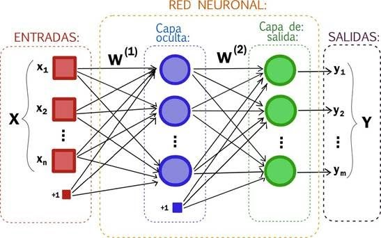
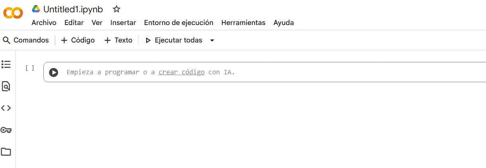
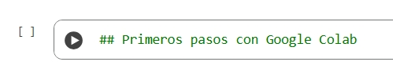
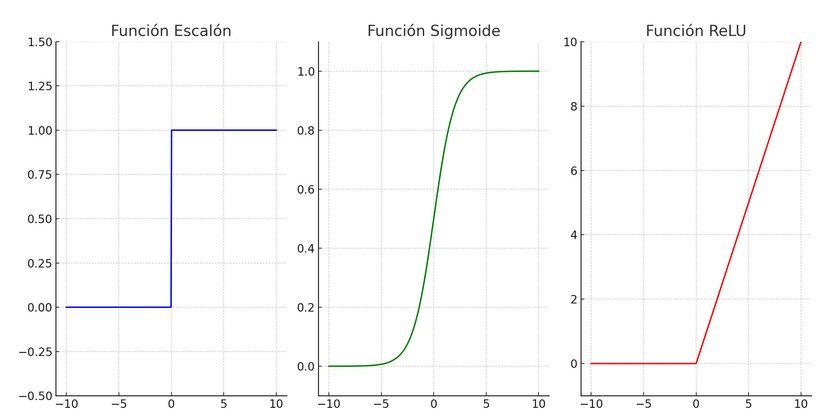
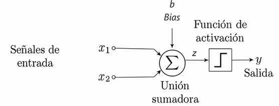
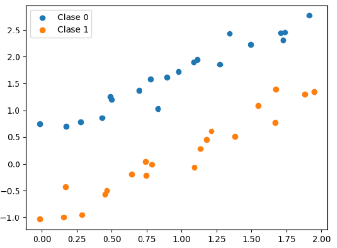
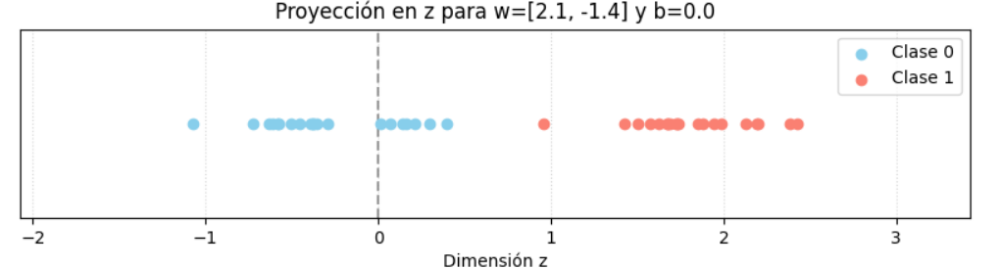

En el sprint anterior hemos visto los conceptos básicos de Machine Learning. En este segundo sprint vamos a ver cómo crear nuestros propios modelos de Machine Learning utilizando herramientas accesibles y gratuitas.

## Sesión 1. Perceptrón y Google Colab

El **aprendizaje automático**, conocido en inglés como *Machine Learning* (**ML**), es un subcampo de la inteligencia artificial que se centra en el desarrollo de algoritmos y modelos que permiten a las máquinas aprender de los datos y realizar predicciones o tomar decisiones sin ser programadas explícitamente para cada tarea. Podríamos considerar qué es un nuevo paradigma de programación, en el que en lugar de escribir código para resolver un problema, se entrena un modelo con datos relevantes para que aprenda a resolverlo.

Dentro del *Machine Learning*, podríamos distinguir tres paradigmas principales de aprendizaje:

1. **Aprendizaje supervisado**: En este paradigma, el modelo se entrena con un conjunto de datos etiquetados, es decir, cada entrada tiene una salida correspondiente conocida. El objetivo es que el modelo aprenda a mapear las entradas a las salidas correctas. Por ejemplo, un modelo de clasificación de imágenes que aprende a identificar diferentes tipos de objetos en fotos etiquetadas.

2. **Aprendizaje no supervisado**: En este caso, el modelo se entrena con datos no etiquetados y debe encontrar patrones o estructuras subyacentes en los datos por sí mismo. Un ejemplo común es el clustering, donde el modelo agrupa datos similares sin conocer las categorías de antemano. 
Las plataformas de comercio electrónico utilizan esta técnica para ver tus hábitos de navegación y compra, agrupándote con otros usuarios que comparten intereses similares. Esto ayuda a crear una experiencia de compra personalizada, mostrándote productos que coincidan con lo que te gusta, sin que nadie le diga al sistema en qué categorías caes.

3. **Aprendizaje por refuerzo**: Aquí, el modelo aprende a tomar decisiones mediante la interacción con un entorno. Recibe recompensas o castigos en función de sus acciones y ajusta su comportamiento para maximizar las recompensas a lo largo del tiempo. Este paradigma es común en juegos y robótica. Ejemplos de aprendizaje por refuerzo incluyen; juegos de estrategia como StarCraft o ajedrez, donde los jugadores de IA aprenden a través de la experiencia y la retroalimentación.Y vehículos autónomos que aprenden a navegar en entornos complejos mediante la interacción con el entorno y la retroalimentación recibida.

### 1.1 ¿Qué son las redes neuronales?

Las **redes neuronales** son un conjunto de algoritmos inspirados en la estructura y funcionamiento del cerebro humano, diseñados para reconocer patrones y aprender de los datos. Están compuestas por capas de nodos (o "neuronas") qu7e procesan la información y transmiten señales a través de conexiones ponderadas.

{ .center width=60% }

<p style="text-align: center"><em>Esquema red neuronal. <a href=https://www.idecor.gob.ar/introduccion-a-las-redes-neuronales-convolucionales-para-clasificacion-de-imagenes/>Fuente IDECOR</a></em></p>

Las redes neuronales artificiales de más de una capa se conocen como **redes neuronales profundas** o **Deep Learning**. Estas redes son capaces de aprender representaciones jerárquicas de los datos, lo que las hace especialmente efectivas para tareas complejas como el reconocimiento de imágenes, el procesamiento del lenguaje natural y la traducción automática.

Podríamos pensar que la red neuronal es como una red de filtros. Pensando en el reconocimiento de datos, y siguiendo la analogia de la red de filtros, una primera capa detectaría formas simples (líneas, colores), la siguiente combinaría esas formas para detectar patrones más complejos (círculos, cuadrados), y las últimas capas identificarían un objeto completo (un gato, una persona).

Para entender mejor cómo funcionan las redes neuronales, es útil conocer algunos conceptos clave, empeceomos con un perceptrón simple.

### 1.2 El perceptrón

El perceptrón no es otra cosa que la red neuronal más simple. Su función es actuar como un algoritmo de clasificación binaria, es decir, un sistema que toma una decisión y da una respuesta de "si" o "no" (representado por 1 o 0).

{ .center width=60% }

Expliquemos inicialmente cómo funciona un perceptrón con un ejemplo cotidiano. Imaginemos que el Perceptrón debe decidir si vamos a la playa o no, basándose en tres factores:

- ***x1***: ¿Está soleado? (1 para sí, 0 para no)
- ***x2***: ¿Es fin de semana? (1 sí, 0 no)
- ***x3***: ¿Tenemos trabajo pendiente? (1 sí, 0 no)

Cada entrada tiene un peso (**w1**​,**w2**​,**w3**​) que representa su importancia. Por ejemplo, "hace sol" (w1​=0.6) puede ser más importante que "ser fin de semana" (w2​=0.4). "Tener trabajo" sería un inhibidor, así que tendría un peso negativo (w3​=−0.8). *El*Bias* (*b*), también conocido como *sesgo* o *umbral*, se podría entender como la predisposición de la persona a ir a la playa, por ejemplo, si le encanta la playa, el sesgo sería un valor muy alto, ya que iría a la playa aunque no se den las condiciones ideales. Si es una persona *anti-playa*, el bias sería un número negativo, ya que no iría a la playa aunque se den las condiciones ideales.

Una vez conocidos los pesos y el sesgo, el Perceptrón realiza una suma ponderada de las entradas: $z=(x1​⋅w1​)+(x2​⋅w2​)+(x3​⋅w3​)+b$.
Finalmente, una **función de activación** (en el Perceptrón simple, sería una **función escalón**), decide si vamos o no a la playa:,

- Si $z>0$, entonces la salida es 1 (vamos a la playa).
- Si $z\leq0$, entonces la salida es 0 (no vamos a la playa).

Antes de profundizar en el funcionamiento del perceptrón, es fundamental conocer una herramienta clave: ***Google Colab***. Esta plataforma resulta especialmente útil para estudiantes de bachillerato, ya que permite programar en Python, analizar datos y visualizar resultados de manera sencilla. Google Colab es ideal para proyectos educativos y experimentos prácticos, y se utiliza ampliamente en el aprendizaje de Machine Learning. Ofrece acceso gratuito a recursos computacionales avanzados y un entorno colaborativo donde se pueden crear, compartir y ejecutar cuadernos interactivos, lo que facilita y acelera el proceso de aprendizaje y experimentación en inteligencia artificial.


!!! note "Google Colab: Primeros pasos"
    
    - Accede a [Google Colab](https://colab.research.google.com/).
    - Crea un nuevo cuaderno (notebook).

    { .center width=80% }

    *Google Colab* se basa en ***Jupyter Notebooks***, una herramienta muy popular en la comunidad de ciencia de datos y aprendizaje automático. Permite escribir y ejecutar código Python en un entorno interactivo, combinando código, texto, ecuaciones y visualizaciones en un solo documento.

    Un cuaderno *Jupyter* se compone de **Celdas** que pueden contener código o texto. 

    - Inserta una celda de texto y escribe como título `## Mi primer cuaderno en Google Colab`. En la parte derecha de la celda observas un icono de lápiz, que indica que la celda está en modo edición. Haz clic en el icono para salir del modo edición y ver el formato aplicado.
    { .center width=60% }
    
    - En el siguiente enlace tienes un tutoríal básico sobre el lenguaje de marcado *Markdown*, que es el que se utiliza para dar formato al texto en las celdas de texto de los cuadernos Jupyter: [Markdown Guide](https://colab.research.google.com/notebooks/markdown_guide.ipynb?hl=es-es)

    - Crea otra celda de texto con un subtítulo de nivel 3 y haz una enumeración de los parámetros del perceptrón que hemos visto (entradas, pesos, sesgo, función de activación).
  
    - Inserta una celda de tipo texto y escribe la formula de la suma ponderada del perceptrón haciendo uso de la nomenclatura matemática de *LaTeX* que puedes encontrar en la sección de Ecuaciones del enlace anterior.
    - Nombra tu cuaderno como "MiPrimerCuaderno.ipynb". Guardalo en tu Google Drive.
    - Añade una celda de código y copia el siguiente código para calcular la salida del perceptrón en función de las entradas, pesos y sesgo que hemos visto en el ejemplo de ir a la playa. Ejecuta la celda para ver el resultado.

    ```python
        # Definición de entradas
        x1 = 1  # Está soleado
        x2 = 1  # Es fin de semana
        x3 = 0  # No tenemos trabajo pendiente
        # Definición de pesos
        w1 = 0.6  # Peso para "Está soleado"
        w2 = 0.4  # Peso para "Es fin de semana"
        w3 = -0.8 # Peso para "No tenemos trabajo pendiente"
        # Definición del sesgo
        b = 0.2   # Sesgo
        # Cálculo de la suma ponderada
        z = (x1 * w1) + (x2 * w2) + (x3 * w3) + b
        # Función de activación (función escalón)
        output = 1 if z > 0 else 0
        print("Salida del perceptrón (1: Vamos a la playa, 0: No vamos a la playa):", output)
    ```
    - Guarda el cuaderno en tu Google Drive.
    


<!--
El Perceptrón realiza una suma ponderada de las entradas: z=(x1​⋅w1​)+(x2​⋅w2​)+(x3​⋅w3​)+b, donde b es un sesgo (bias) o umbral. 
Sus componentes claves son:

- **Entradas ($x_i$)**: Son los datos que se introducen en el perceptrón. Cada entrada representa una característica del dato que se está clasificando. 
- **Pesos ($w_i$)**: No todas las entradas tienen la misma importancia. Los pesos son valores asignados a cada entrada que indican su relevancia en la decisión final. Un peso alto significa que esa entrada es muy importante, mientras que un peso bajo indica que tiene poca influencia.
- **Suma ponderada**: Es el resultado de multiplicar cada entrada por su peso correspondiente y luego sumar todos esos productos. Esta suma determina la activación del perceptrón:
  $\text{Suma Ponderada} = \sum_{i=1}^{n} x_{i} w_{i}$
- **Umbral, sesgo o bias ($t$)**: Es un valor que se suma a la suma ponderada antes de aplicar la función de activación. El umbral ayuda a ajustar la sensibilidad del perceptrón y permite que el modelo se adapte mejor a los datos.
<!--- **Función de activación**: Es una función matemática que toma la suma ponderada (más el umbral) como entrada y produce una salida. La función de activación más común para un perceptrón es la **función escalón**, que devuelve 1 si la suma ponderada es mayor o igual al umbral, y 0 en caso contrario. Pero también se pueden usar otras funciones como la sigmoide o ReLU (Rectified Linear Unit). 

{ .center width=80% }
-->


## Sesión 2, 3: Introducción a Python.

Python es un lenguaje de programación muy popular debido a su simplicidad y versatilidad. Es ampliamente utilizado en ciencia de datos, desarrollo web, automatización y, por supuesto, en Machine Learning. Algunas de las características que hacen que Python sea ideal para principiantes incluyen:

- **Sintaxis sencilla**: La sintaxis de Python es clara y fácil de leer, lo que facilita el aprendizaje para los principiantes.
- **Gran comunidad**: Python tiene una comunidad activa que ofrece una gran cantidad de recursos, tutoriales y bibliotecas.
- **Bibliotecas para Machine Learning**: Python cuenta con numerosas bibliotecas especializadas en Machine Learning, como TensorFlow, Keras, Scikit-learn y PyTorch, que facilitan la implementación de modelos complejos.
- **Entornos interactivos**: Herramientas como Jupyter Notebooks y Google Colab permiten a los usuarios escribir y ejecutar código en un entorno interactivo, lo que es ideal para el aprendizaje y la experimentación.

!!! note "AC - Primeros pasos con Python en Google Colab"
    
    Vais a trabajar de forma individual en un cuaderno interactivo de Google Colab llamado "Introducción a Python". Este cuaderno contiene explicaciones y 12 pequeños ejercicios prácticos distribuidos en seis bloques temáticos: operadores, listas, cadenas, condicionales, bucles y funciones.   
   
    1. Abre un nuevo cuaderno en Google Colab.
    1. Crea una celda de texto y escribe el título `# Introducción a Python`.
    1. Vamos a crear una sección de nivel 2 para cada uno de los bloques temáticos. Crea una celda de texto y escribe `## Operadores`.
    1. A continuación, crea una celda de código e implementa los ejercicios del bloque de operadores. Puedes consultar el cuaderno de referencia [Python basics - Google Colab](https://colab.research.google.com/github/data-psl/lectures2020/blob/master/notebooks/01_python_basics.ipynb#scrollTo=qyLSwlxnJqXX).
    1. Repite el proceso para los otros cinco bloques temáticos: listas, cadenas, condicionales, bucles y funciones.
    1. Guarda el cuaderno en tu Google Drive con el nombre "Introducción a Python.ipynb".


    **OPERADORES ARITMÉTICOS**

    Los operadores aritméticos nos permiten realizar cálculos matemáticos.

      - **Actividad 1 (Operadores): Calculadora de Área y Perímetro**. 
      Crea un programa que calcule el área y el perímetro de un rectángulo. Define dos variables, base y altura, con los valores que tú elijas. Luego, muestra los resultados por pantalla con un mensaje claro (ej. "El área del rectángulo es: X").

      - **Actividad 2 (Operadores): Conversor de Temperatura**
      Escribe un programa que convierta una temperatura de grados Celsius a Fahrenheit. La fórmula es: F=(C×9/5)+32. Asigna un valor a una variable celsius y muestra el resultado en Fahrenheit.
        
    **LISTAS**

    Las listas son colecciones ordenadas y modificables de elementos. Se definen con corchetes [] y los elementos se separan por comas.

    - **Actividad 3 (Listas): La Lista de la Compra**. Crea una lista llamada lista_compra con tres productos que necesites comprar. Añade un cuarto producto al final de la lista. Elimina el segundo producto de la lista. Muestra la lista final por pantalla.
    - **Actividad 4 (Listas): Calculadora de Nota Media**. Crea una lista con 5 notas numéricas (de 0 a 10). Calcula la nota media y muéstrala por pantalla. Pista: puedes usar las funciones sum() para sumar los elementos y len() para saber cuántos elementos hay.

    **CADENAS**

    Las cadenas son secuencias de caracteres, como palabras o frases. Se definen con comillas simples ' o dobles ".

    - **Actividad 5: Creador de Saludos**. Define dos variables de tipo cadena, una para un nombre y otra para una ciudad. Concaténalas para crear una frase que diga "Hola, [nombre] de [ciudad]. ¡Bienvenido/a a Python!".

    - **Actividad 6: Contador de Vocales**. Dada una cadena de texto, cuenta cuántas veces aparece la vocal 'a' (mayúscula o minúscula). Pista: convierte primero toda la cadena a minúsculas con el método `.lower()`. Para contar, puedes usar el método `.count()`.

    **CONDICIONALES**

    Los condicionales (`if`, `elif`, `else`) nos permiten ejecutar un bloque de código solo si se cumple una determinada condición.

    - **Actividad 7: ¿Par o Impar?**. Escribe un programa que, dado un número, determine si es par o impar. Si el resto de dividir el número entre 2 es 0, es par. De lo contrario, es impar. Muestra un mensaje apropiado en cada caso.
    - **Actividad 8: Sistema de Calificación**. Crea un programa que, dada una nota numérica (de 0 a 10), indique si el alumno ha "Aprobado" (si la nota es 5 o superior) o "Suspendido" (si es menor de 5).
  
    **BUCLES**

    Los bucles nos permiten repetir un bloque de código varias veces. Los más comunes son el bucle for (para recorrer elementos) y el bucle while (mientras se cumpla una condición).

    - **Actividad 9: La Tabla de Multiplicar**. Escribe un programa que muestre la tabla de multiplicar del número 7 (del 1 al 10). Usa un bucle `for` y la función `range()`.
    - **Actividad 10: Suma de Elementos de una Lista**. Dada una lista de números, utiliza un bucle `for` para sumar todos sus elementos y muestra el total. No utilices la función `sum()`.

    **FUNCIONES**

    Las funciones son bloques de código reutilizables que realizan una tarea específica. Se definen con `def` y pueden recibir parámetros y devolver resultados.

    - **Actividad 11: Saludo Personalizado**. Crea una función llamada `saludar` que reciba un nombre como parámetro y muestre por pantalla un saludo personalizado, como "¡Hola, [nombre]! Que tengas un gran día.". Llama a la función con tu propio nombre.

    - **Actividad 12: Calculadora de Factorial**. Crea una función que calcule el factorial de un número. El factorial de un número n (escrito como n!) es la multiplicación de todos los números enteros desde 1 hasta n. Por ejemplo, 5! = 1 * 2 * 3 * 4 * 5 = 120.


## Sesión 4: Fundamentos de Numpy

NumPy es una de las bibliotecas de Python más populares para la computación científica y el análisis de datos. Las estructuras de datos básicas en NumPy son las matrices N-dimensionales. 
Para empezar a trabajar con NumPy, primero debe instalar la biblioteca e importarla a su entorno de trabajo.

!!! note "AC-Instalación de NumPy"

    Para instalar NumPy, abre tu terminal y ejecuta el siguiente comando: ``` pip install numpy ```
    
    Si trabajas en Google Colab, NumPy ya viene preinstalado, por lo que solo necesitas importarlo en tu cuaderno con el siguiente comando:
    ```python
    import numpy as np
    ```

!!! note "AC - Primeros pasos con NumPy"

    Haciendo uso del cuaderno de Google Colab que has creado en la sesión anterior, añade una nueva sección de nivel 2 con el título `## Introducción a NumPy`. A continuación, realiza las siguientes actividades:

    1. Importa la biblioteca NumPy con el alias `np`.
    2. Crea un array unidimensional (vector) con los números del 1 al 10.
    3. Crea un array bidimensional (matriz) de 3x3 con números aleatorios entre 0 y 1.
    4. Realiza una operación matemática simple, como sumar 5 a cada elemento del array unidimensional.
    5. Calcula la media y la desviación estándar del array bidimensional.
    6. Guarda el cuaderno en tu Google Drive.

    Referencia básica:

    - [Numpy Python Basics - Colab](https://colab.research.google.com/github/data-psl/lectures2020/blob/master/notebooks/01_python_basics.ipynb#scrollTo=qyLSwlxnJqXX)
    - [NumPy Quickstart Tutorial](https://numpy.org/doc/stable/user/quickstart.html)

## Sesión 5,6: Perceptron en Python I

Vamos a implementar un perceptrón simple en Python utilizando *Numpy* y *Matplotlib* para visualizar los resultados. El perceptrón será capaz de aprender a clasificar puntos en un espacio bidimensional, por lo que recibirá como entrada *x1* y *x2*, que corresponderán a las coordenadas de los puntos en un plano cartesiano.

{ .center width=60% }

Si el perceptrón devuelve un valor negativo, clasificaremos el punto en la clase 0 (por ejemplo, color azul). Si devuelve un valor positivo, lo clasificaremos en la clase 1 (color naranja).

{ .center width=50% }

Como vimos anteriormente, para que el perceptrón tome una decisión, deberá ajustar los parámetros de los pesos(*w1 , w2*) y el sesgo (*b*). Esto es es la idea del problema a resolver y a continuación vamos a ver como funciona internamente el perceptrón.

!!! note "AC - Perceptron en Python 1"

    1. Crea un nuevo cuaderno en Google Colab y nómbralo "Perceptron en Python".
    2. Importa las bibliotecas necesarias: `numpy` como `np` para cálculos numéricos y `matplotlib.pyplot` como `plt` para visualización.
    3. Copia y pega el siguiente código y ejecutalo.

    ```python
        # Datos estáticos para la Clase 0
        class_0 = np.array([
            [0.1745, 0.6976], [0.2799, 0.7828], [0.4983, 1.2015], [0.8281, 1.0315],
            [0.7770, 1.5834], [0.4316, 0.8576], [0.4897, 1.2523], [0.6931, 1.3653],
            [0.8953, 1.6119], [1.0863, 1.8986], [1.2721, 1.8596], [1.3435, 2.4287],
            [1.7224, 2.3023], [1.7081, 2.4461], [1.9125, 2.7663], [0.9785, 1.7225],
            [1.1105, 1.9444], [1.4924, 2.2265], [1.7377, 2.4571], [-0.0123, 0.7481]
        ])

        # Clase 1 (roja)
        class_1 = np.array([
            [0.2869, -0.9575], [0.1711, -0.4289], [0.4639, -0.4998], [0.6413, -0.1982],
            [0.7431, 0.0401], [0.1584, -0.9995], [0.452, -0.5633], [0.7490, -0.2185],
            [0.7854, -0.0175], [1.0898, -0.0683], [1.1785, 0.4474], [1.6701, 0.7713],
            [1.6723, 1.3858], [1.8800, 1.2988], [1.1344, 0.2818], [1.2138, 0.6139],
            [1.3835, 0.5055], [1.5458, 1.0895], [1.9452, 1.3496], [-0.0134, -1.0373]
        ])


        # Dibuja los puntos de cada clase
        plt.scatter(class_0[:, 0], class_0[:, 1], label='Clase 0')
        plt.scatter(class_1[:, 0], class_1[:, 1], label='Clase 1')

        # Añade una leyenda para identificar las clases
        plt.legend()

        # Muestra la gráfica
        plt.show()
    ```
    
    * Los datos de los arrays `class_0` y `class_1` representan las coordenadas (x1, x2) de los puntos en el espacio bidimensional. Cada punto en `class_0` pertenece a la clase 0 (color azul) y cada punto en `class_1` pertenece a la clase 1 (color naranja).
    * La función `plt.scatter()` se utiliza para dibujar los puntos en la gráfica. Recuerda que `class_0[:, 0]` obtiene los valores de la primera columna (x1) y `class_0[:, 1]` obtiene los valores de la segunda columna (x2). Igualmente para `class_1`.
    * La función `plt.legend()` añade una leyenda a la gráfica para identificar las clases.
    * Finalmente, `plt.show()` muestra la gráfica con los puntos de ambas clases.

    Recursos:
    - [Documentación de Matplotlib.pyplot](https://matplotlib.org/stable/tutorials/pyplot.html).


Una vez entendida la estructura de datos para almacenar los puntos de cada clase, vamos a implementar la lógica del perceptrón.

!!! note "AC - Perceptron en Python 2"

    Continuando con el cuaderno "Perceptron en Python", añade una nueva celda de código y copia el siguiente código para implementar la lógica del perceptrón. Ejecuta la celda para ver los resultados.

    **Modifica los parámetros $w_1$, $w_2$ hasta obtener una buena clasificación de los puntos.**

    ```python
       # Funcion activación  
        def f_activacion(x1, x2, w1, w2, b):
            z = w1 * x1 + w2 * x2 + b
            # Función de activación  if z >= 0, devolver 1, sino devolver 0
            return 1 if z >= 0 else 0


        # Modifica las variables a valores deseados
        w1 = 1
        w2 = 1
        b = 0

        # Evalua la clasificación para la class_0
        aciertos_class_0 = 0
        for punto in class_0:
            z = f_activacion(punto[0], punto[1], w1, w2, b)
            if z == 0:  # Class 0 cuando f_activación devuelve 0
                aciertos_class_0 += 1

        # Evalua la clasificación para la class_1
        aciertos_class_1 = 0
        for punto in class_1:
            z = f_activacion(punto[0], punto[1], w1, w2, b)
            if z == 1: # Class 1 cuando f_activación devuelve 1
                aciertos_class_1 += 1

        # Cálculo de porcentajes de aciertos
        total_class_0 = len(class_0)
        total_class_1 = len(class_1)
        tasa_aciertos_class_0 = aciertos_class_0 / total_class_0
        tasa_aciertos_class_1 = aciertos_class_1 / total_class_1


        print(f"-Tasa aciertos para clase 0: {aciertos_class_0} ({tasa_aciertos_class_0 *100}%)")
        print(f"-Tasa aciertos para clase 0: {aciertos_class_1} ({tasa_aciertos_class_1*100}%)")
    ```

## Sesión 7,8: Perceptron en Python II

Básicamente, lo que hace nuestro perceptrón es tomar las coordenadas de cada punto (x1, x2) y calcular la suma ponderada utilizando los pesos (*w1*, *w2*) y el sesgo (*b*), transformando un dato de dos dimensiones en un valor escalar (*z*), un valor unidimensional. Por tanto, la clave para que el perceptrón clasifique correctamente están en los valores de los parámetros anteriores. 

!!! note "AC - Perceptron en Python 3"

    Vamos a representar gráficamente la frontera de decisión del perceptrón representando los valores de *z*. Modificaremos los valores por medio de un deslizador (*slider*), para ver cómo afecta a la clasificación de los puntos cada uno de los puntos.

    Añade una celda nueva y copia el siguiente código. Ejecuta la totalidad de las celdas del cuaderno.

    ```python
    from ipywidgets import interact
    @interact(
        w0=(-4.0, 4.0, 0.1),
        w1=(-4.0, 4.0, 0.1),
        b=(-3.0, 3.0, 0.1)
    )
    # --- 3. Definimos la función que se ejecutará con cada cambio ---
    def actualizar_grafica(w0= 0, w1= 0, b= 0):
        """
        Esta función recalcula 'z' y redibuja la gráfica
        cada vez que se mueve un slider.
        """
        w = np.array([w0, w1])
        z = np.dot(X, w) + b

        z_class_0 = z[:len(class_0)]
        z_class_1 = z[len(class_0):]

        # Creamos una figura nueva para la gráfica
        plt.figure(figsize=(10, 2))

        # Dibuja los puntos
        plt.scatter(z_class_0, np.zeros_like(z_class_0), label='Clase 0', zorder=3, c='skyblue')
        plt.scatter(z_class_1, np.zeros_like(z_class_1), label='Clase 1', zorder=3, c='salmon')

        # Dibuja la línea de referencia en el cero
        plt.axvline(0, color='grey', linestyle='--', alpha=0.8)

        # Estilo
        plt.yticks([])
        plt.xlabel("Dimensión z")
        plt.title(f"Proyección en z para w=[{w0:.1f}, {w1:.1f}] y b={b:.1f}")
        plt.legend()
        plt.grid(axis='x', linestyle=':', alpha=0.5)
        plt.xlim(z.min() -1, z.max() + 1) # Ajusta los límites para que no salten tanto
        plt.show()
    ``` 

    - Observa que cuando *w1* y *w2* son cero, todos los puntos se proyectan en el mismo valor *z=b*.
    - Si modificamos los valores de *w1* y *w2*, los puntos se distribuyen a lo largo del eje *z*. El objetivo es encontrar unos valores de *w1*, *w2* y *b* que separen claramente los puntos de las dos clases. Experimenta con diferentes valores y observa cómo cambia la clasificación.
    - El objetivo es situar los puntos de la clase 0 a la izquierda del cero (valores negativos de *z*) y los puntos de la clase 1 a la derecha del cero (valores positivos de *z*). Pero puede darse el caso que la separación de puntos se haga de forma que los puntos de cada clase se agrupen de forma correcta, pero no estén a un lado u otro del cero. Por ejemplo, en el caso *w1=2.1* y *w2=-1.4*.

    { .center width=80% }

    - En este punto, analizamos el uso del *umbral* o *bias* (*b*) en el perceptrón. Básicamente, el *bias* permite desplazar la frontera de decisión del perceptrón a lo largo del eje *z*. Gráficamente sería mover la coordenada cero para que todos los puntos de una clase estén a un lado y los de la otra clase al otro lado. Haz la prueba con distintos valores sin modificar *w1* y *w2*.


 
<!--
## Sesión 7:

## Sesión 8:

-->
## Recursos

- [El Perceptón ¡explicado! (demo interactivo)](https://youtu.be/pCy4yPzcCqs?si=lkKWg4wjUMyDdfxp)
- [Python basics - Google Colab](https://colab.research.google.com/github/data-psl/lectures2020/blob/master/notebooks/01_python_basics.ipynb#scrollTo=ASpVhol9ZXI0)