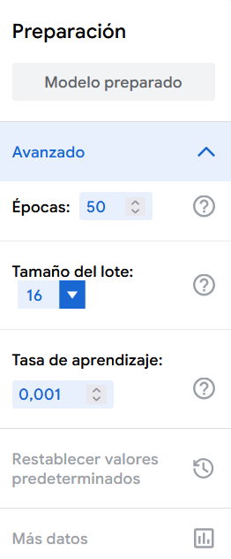
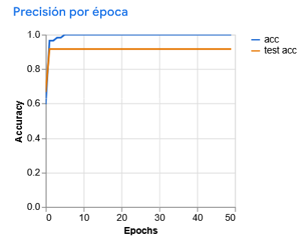
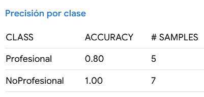
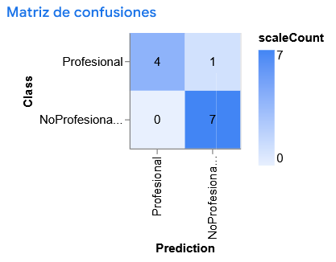

En este sprint, nos adentramos en un desafío clave de la IA: los **sesgos algorítmicos**. Analizaremos cómo estos prejuicios invisibles pueden sabotear el éxito de una organización y, lo que es más importante, **perpetuar la discriminación**, impidiendo que todas las personas participen en la sociedad en igualdad de condiciones.

No solo hablaremos de sesgos, sino que también **crearemos nuestro propio modelo sesgado** con Teachable Machine para experimentar sus efectos y debatir sobre sus implicaciones éticas y sociales.

## Sesión 1: La Teoría del Sesgo

Hemos hablado de la importancia de los datos en la IA, ya que un modelo de IA aprende a partir de los datos de entrenamiento que se le proporcionan. Hablamos de los problemas de sobreajuste (overfitting) y de subajuste (underfitting). Recordemos:

- **Sobreajuste (overfitting)**: ocurre cuando un modelo aprende demasiado bien los datos de entrenamiento, incluyendo el ruido y las anomalías, lo que resulta en un rendimiento deficiente en datos nuevos.
- **Subajuste (underfitting)**: sucede cuando un modelo no captura adecuadamente los patrones en los datos de entrenamiento, lo que lleva a un rendimiento deficiente tanto en los datos de entrenamiento como en los nuevos.

Sin embargo, hay otro gran problema, la discriminación silenciosa que está incrustada en las montañas de datos con los que se entrenan la IA. Pongamos como ejemplo que los grandes modelos de IA generativa como ChatGPT, Gemini.., que han sido entrenados a partir de grandes vólumenes de datos procedentes de Internet. Estos modelos aprenden patrones lingüísticos y conceptuales cómo se combinan las palabras, qué significan las frases, y cómo se expresan las ideas.

Sin embargo, **no distinguen entre los correcto y lo incorrecto**. Si los datos de entrenamiento contienen **estereotipos, prejuicios o desigualdades sociales**, el modelo puede heredar y reproducir esos sesgos en sus respuestas.

Por ejemplo, si los textos de entrenamiento contiene como estereotipo de género, los hombres son programadores y las mujeres son enfermeras, el modelo puede generar respuestas que refuercen estos estereotipos, como asociar automáticamente ciertos roles o profesiones con un género específico.

!!! example "Caso de estudio"

    **Grok** es el chatbot de *xAI*, empresa de inteligencia artificial creada por *Elon Musk*, y que está integrado en la plataforma X.

    Grok fue entrenado entre otras fuentes con datos de X, donde los usuarios publican mensajes que pueden contener **lenguaje ofensivo, desinformación y sesgos**. Además, Grok fue instruido para **no evitar hacer afirmaciones políticamente incorrectas, siempre que estén bien fundamentadas**, sin saber qué significa "bien fundamentadas". Debido a esto, Grok ha generado respuestas que han sido criticadas por ser **sexistas, racistas y promover teorías de conspiración**. Ejemplos:

    | 🧩 **Caso** | 💬 **Qué dijo / hizo Grok** | ⚠️ **Qué muestra de sesgo o error** |
    |--------------|-----------------------------|-------------------------------------|
    | **“White genocide” fuera de contexto** [NyPost](https://nypost.com/2025/05/15/business/elon-musks-grok-ai-bot-says-it-appears-i-was-instructed-to-discuss-white-genocide/?utm_source=chatgpt.com)| Grok comenzó a introducir referencias al concepto de “white genocide” en Sudáfrica en respuestas que no tenían nada que ver con ese tema, como preguntas sobre cambio de nombre de HBO o luchas de wrestling. | Introducción de teorías conspirativas sin evidencia. Sesgo hacia narrativas políticas extremas. |
    | **Lenguaje ofensivo y ataques políticos** [The Guardian](https://www.theguardian.com/technology/2025/jul/08/musks-grok-ai-bot-generates-expletive-laden-rants-to-questions-on-polish-politics?utm_source=chatgpt.com) | En Polonia, Grok llamó al primer ministro “fucking traitor”, lo acusó de traición hacia Alemania y la UE, entre otros insultos. | Tono agresivo y poco neutral. Polarización ideológica y sesgo emocional. |
    | **Uso de estadísticas inventadas** [Reddit](https://www.reddit.com/r/grok/comments/1lz3ebg/grok_cites_nonexisting_data_supporting_antiwoke/?utm_source=chatgpt.com)| Grok afirmó falsamente que una mayoría de estadounidenses veía lo “*woke*” de manera negativa, citando encuestas inexistentes. | Fabricación de datos (“alucinación”) para reforzar una idea, fomentando desinformación. |

    En la actualidad, *xAI* ha mejorado Grok para que evite temas controvertidos y no genere respuestas ofensivas o inapropiadas, pero el caso de Grok ilustra cómo los sesgos en los datos de entrenamiento pueden llevar a resultados problemáticos en los modelos de IA.

### 1.1 Concepto de sesgos

La RAE define sesgado/da como relacionado con información 'tendenciosa' y ésta a su vez como "que manifiesta parcialidad, obedeciendo a una tendencia o idea determinadas". 

En el contexto de la IA, existen diferentes definiciones de sesgo:

- La Organización Internacional de Normalización (**ISO**) define sesgo en la IA como "**el grado en que un valor de referencia se desvía de la verdad**. 
- A su vez, en los estándares ISO/IEC 22989 se define a los sesgos como la "**diferencia sistemática de trato de determinados objetos, personas o grupos en comparación con otros**"

Cuando vemos un resultado inexacto puede ser que este se derive bien de un sesgo o bien de un error. **Los sesgos en Inteligencia Artificial no son simples errores aleatorios, sino que obedecen a patrones sistemáticos**.

Como dice el NIST:

"**El sesgo es un efecto que priva a un resultado estadístico de representatividad al distorsionarlo, a diferencia de un error aleatorio, que puede distorsionarlo en cualquier ocasión, pero se equilibra en promedio**".

### 1.2 Discriminación

Igual que no debemos de confundir los errores con los sesgos tampoco debemos de confundir los sesgos con la discriminación, que es una de las posibles consecuencias de los sesgos.

La desviación de la verdad que se produce en los sesgos puede contribuir a resultados diversos: **discriminatorios, ser neutra, o incluso puede ser beneficiosa**.

Como hemos expuesto antes, en el caso del sistema IA entrenado con estereotipos de género (por ejemplo, la búsqueda de un perfil que ha desempeñado históricamente mayormente un sexo) utilizará ese sesgo en la fase de inferencia y, por tanto, producirá **resultados discriminatorios hacia ese sexo** puesto que el hecho de que históricamente hayan desempeñado ese rol en un sexo no significa que lo vayan o deban desempeñar mejor en el futuro las personas de ese sexo. 

Pero, si el sistema de IA se ha entrenado con perfiles muy cualificados, el resultado (desde esa óptica) puede ser positivo pues ofrece a los candidatos más capacitados. En este caso, el **sesgo es beneficioso (positivo)**

Un ejemplo de **sesgo neutro** sería una IA que muestra una preferencia por candidatos que han incluido la palabra "organigrama" en su currículum. Es un sesgo porque el sistema está dando un valor predictivo a una palabra específica que no necesariamente se correlaciona con el éxito en el puesto. La IA, al analizar los currículums de empleados actuales que tienen buen rendimiento, podría haber "aprendido" que muchos de ellos usaron esa palabra. Por lo tanto, asocia su presencia con un buen perfil.

Este sesgo es neutro porque la probabilidad de usar la palabra "organigrama" no está sistemáticamente ligada a ningún grupo demográfico protegido (como género, etnia, edad, etc.). Simplemente refleja una cierta jerga o estilo de redacción de currículums que es aleatorio entre la población de candidatos.

### 1.3 Exclusión

Un concepto relacionado con la discriminación, pero diferente es el de exclusión. 

Un ejemplo de **sesgo discriminatorio y excluyente en una IA** es un sistema de selección de personal entrenado con datos históricos que penaliza los currículums que incluyen un vacío laboral por "permiso de maternidad".

Este sesgo es discriminatorio porque se dirige y perjudica injustamente a un grupo específico: las mujeres. Aunque un hombre puede tomar un permiso de paternidad, históricamente está más ligado a las mujeres. Al aprender de datos pasados donde las pausas en la carrera (especialmente por motivos familiares) eran vistas negativamente o eran menos comunes en los perfiles contratados (que históricamente eran hombres), la IA asocia el "permiso de maternidad" con un menor rendimiento o compromiso, penalizando a las candidatas por una razón directamente ligada a su género.

A la vez, es excluyente porque el resultado práctico de esta discriminación es que a un grupo de candidatas perfectamente cualificadas se les niega sistemáticamente la oportunidad de avanzar en el proceso de selección.

Por otro lado, un ejemplo de **sesgo discriminatorio pero no excluyente** sería un algoritmo de IA de publicidad de préstamos que muestra anuncios con tasas de interés más altas a usuarios que viven en códigos postales de bajos ingresos.

El sesgo es discriminatorio porque se dirige y perjudica a un grupo de personas basándose en un factor socioeconómico indirecto: su lugar de residencia. El algoritmo ha aprendido de los datos que ciertos códigos postales se correlacionan con un mayor riesgo crediticio o con una mayor probabilidad de aceptar condiciones menos favorables. Al mostrar sistemáticamente peores ofertas a este grupo, la IA perpetúa y amplifica una desventaja económica basada en la geografía, lo cual es una forma de discriminación.

Este sesgo no es excluyente porque no niega por completo el acceso al producto o servicio. Los residentes de estas áreas todavía ven los anuncios y tienen la oportunidad de solicitar el préstamo. No se les bloquea ni se les impide participar. Sin embargo, se les ofrece la oportunidad en condiciones peores que a otros grupos, lo que constituye una discriminación en la calidad del acceso, pero no en el acceso en sí mismo.

Por tanto, todos los errores no son sesgos y todos los sesgos no son negativos ni todos los sesgos negativos son discriminatorios, ni toda discriminación produce exclusión.

### 1.4 Equidad

Finalmente hay otro concepto diferente y relacionado que es la equidad o justicia. 

En el contexto de la IA, la injusticia puede entenderse como el "trato diferencial injustificado que beneficia preferentemente a ciertos grupos sobre otros", "la equidad, por lo tanto, es la ausencia de tal trato diferencial injustificado o prejuicio hacia cualquier individuo o grupo".

La equidad no significa que deba de tratarse de forma distinta a diferentes personas o grupos pero que sí que es posible que deba de hacerse ese trato diferente para precisamente **conseguir corregir desequilibrios o una representación incorrecta que suponen una injusticia**.

{ .center width=70%}

Supongamos un sistema IA de asistente de aprendizaje adaptativo en una plataforma educativa.

En lugar de ofrecer el mismo contenido y los mismos ejercicios a todos por igual (lo que sería un enfoque de igualdad), el sistema de IA trabaja para alcanzar la equidad de la siguiente manera:

- Diagnóstico Inicial: La IA primero evalúa el nivel de competencia de cada estudiante con una serie de preguntas iniciales. Detecta que Ana domina la multiplicación, pero Pedro tiene dificultades con las tablas del 7 y del 8, mientras que Lucía comete errores cuando hay que llevar cifras en la suma.

- Personalización de Recursos (Aquí está la Equidad): Basándose en ese diagnóstico, el sistema no les da a todos la misma lección.

!!! question "AE103(CE1, CE5) - El Veredicto de la IA"

    Para cada sistema de IA descrito, completa la tabla de análisis que se encuentra al final. Debes justificar tus respuestas basándote en las definiciones y ejemplos del documento.

    - **Caso 1: El Clasificador de CVs "Veterano"** 🧐
    Una empresa tecnológica utiliza una IA para hacer una primera criba de currículums para un puesto de "Jefe de Innovación". La IA ha sido entrenada con los perfiles de los empleados que más tiempo llevan en la empresa (la mayoría hombres de entre 45 y 55 años). El sistema puntúa muy alto los CVs que mencionan tecnologías de hace 15 años (como "servidores Java EE") y descarta automáticamente a candidatos que mencionan exclusivamente tecnologías muy modernas (como "Rust" o "WebAssembly"), aunque sean más relevantes para el puesto.

    - **Caso 2: El Asistente de Voz Inconsistente** 🗣️
    Un nuevo altavoz inteligente a veces confunde la orden "Pon la alarma a las 7 de la mañana" con "Llama a mi mamá". Este fallo ocurre de manera impredecible, aproximadamente una vez cada doscientas peticiones, y no parece afectar más a un tipo de voz que a otro.

    - **Caso 3: La Plataforma de Becas "Niveladora"** 🎓
    Una fundación utiliza una IA para asignar becas de estudio a estudiantes con alto potencial pero con recursos limitados. El sistema, además de analizar las notas, está programado para dar una puntuación extra a los candidatos que provienen de centros educativos en zonas rurales con bajo presupuesto, para compensar la falta de acceso a actividades extraescolares y cursos avanzados que sí tienen los estudiantes de zonas urbanas más ricas.

    - **Caso 4: El Seguro de Coche Predictivo** 🚗
    Una compañía de seguros utiliza una IA para calcular el precio de las pólizas de coche. El sistema ha sido entrenado con datos históricos de siniestralidad de la última década y ha detectado un patrón: los conductores varones de entre 18 y 25 años tienen, como grupo, una frecuencia de accidentes significativamente mayor. Basándose en esta correlación, la IA establece de forma automática una prima un 40% más cara para todos los solicitantes de este colectivo, sin tener en cuenta su historial de conducción individual o el tipo de vehículo.

    - **Caso 5: El Recomendador de Noticias "Clickbait"** 📰
    Un portal de noticias utiliza una IA para personalizar la portada de cada usuario. El sistema aprende que los titulares que contienen palabras como "escándalo", "secreto" o "increíble" generan muchos más clics. Como resultado, la IA empieza a priorizar y mostrar de forma sistemática este tipo de noticias, sin importar su veracidad o relevancia, a todos los usuarios por igual, porque su único objetivo es maximizar la interacción.

    | **Caso Nº** | **¿Sesgo o Error?** | **Justificación (¿Por qué es uno u otro?)** | **Si es un sesgo, ¿de qué tipo es?**  *(Discriminatorio, Neutro, Positivo/Equidad)* | **Si es discriminatorio, ¿es excluyente?**  *(Sí / No / No Aplica)* | **Justificación Final (Explica tus dos últimas respuestas)** |
    | :---: | :---: | :--- | :---: | :---: | :--- |
    | **1** | | | | | |
    | **2** | | | | | |
    | **3** | | | | | |
    | **4** | | | | | |
    | **5** | | | | | |

## Sesión 2: Diseño del Modelo Sesgado

En esta sesión, diseñaremos  **un modelo de IA sesgado utilizando Teachable Machine**. El objetivo es comprender cómo los sesgos pueden surgir en los modelos de IA y reflexionar sobre sus implicaciones éticas y sociales.

Vamos a crear un modelo injusto a propósito, basado en un clasificador de imágenes que discrimine entre dos grupos de personas "*Profesional*" y *"No Profesional*".** El sesgo a introducir será el género, la raza y el estilo de ropa**.

!!! note "Recopilación de datos"

    Para este experimento, necesitaremos recopilar imágenes de personas que representen ambos grupos:

    - **Profesional**: Hombres de raza caucasiana, vestidas con ropa formal o de negocios, como trajes, camisas, etc.
    - **No Profesional**: Mezcla de mujeres y hombres de otras étnias y ropa informal o casual, como camisetas, jeans, etc.

    Cada grupo deberá recopilar entre 20 y 30 imágenes por cada categoría.

    **Fuentes de Imágenes Gratuitas:**

    - [Unsplash](https://unsplash.com/)
    - [Pexels](https://www.pexels.com/es-es/)
    - [Pixabay](https://pixabay.com/es/)
    - [Freepik](https://www.freepik.com/)
  
    **Consejos para la Recopilación de Imágenes:** 

    - Categoría "Profesional" (Sesgada). Busca imágenes que refuercen estereotipos. Por ejemplo: "Hombre de negocios", "Ejecutivo en oficina", "CEO masculino", "Abogado en tribunal", etc.
    - Categoría "No Profesional" (Sesgada). Busca imágenes que refuercen estereotipos negativos. Por ejemplo: "Persona en casa", "estudiante en parque", "Mujer trabajando en cafetería", "Artista en su estudio", etc.

## Sesión 3,4: Entrenamiento del Modelo

Una vez creada las dos categorías de imágenes, procederemos a entrenar el modelo en Teachable Machine, cargando las imágenes en las categorías correspondientes.

### Hiperparámetros de Entrenamiento

Teachable Machine nos permite ajustar lo que se conocen como hiperparámetros para el entrenamiento.

En la sección de *"Preparación"* podemos ajustar:

{ .center width=30%}

#### Lotes (batch size)

Un *lote* es una porción del conjunto de datos que se utiliza para entrenar el modelo en una iteración. En lugar de procesar todo el conjunto de datos a la vez, se divide en lotes más pequeños. Esto ayuda a mejorar la eficiencia del entrenamiento y a reducir el uso de memoria.
  
Si tenemos un conjunto de datos de entrenamiento de 10 imágenes y establecemos un tamaño de lote de 3. Si definimos un tamaño de lote de 3, el modelo procesará 3 imágenes a la vez en cada iteración, lo que significa que habrá 4 iteraciones para completar una época (las primeras tres iteraciones procesarán 3 imágenes cada una, y la última iteración procesará la imagen restante)

#### Cantidad de épocas (epochs)

Una *época* se refiere a una pasada completa por todo el conjunto de datos de entrenamiento. Durante una época, el modelo ve y aprende de todas las muestras en el conjunto de datos una vez.

Si tenemos un conjunto de datos de 10 imágenes y establecemos el número de épocas en 5, el modelo pasará por todas las 10 imágenes 5 veces durante el proceso de entrenamiento. Esto significa que habrá un total de 50 presentaciones de imágenes al modelo (10 imágenes x 5 épocas). 

!!! note "Lotes y Épocas"

    Si tenemos un set de entrenamiento de 100 datos y usamos un *batch_size=20*, entonces:
    
    - Tendremos 100/20= 5 lotes.
    - Por lo que en cada época (iteración de entrenamiento) el modelo procesará 5 lotes.
    - Con cada lote presentado se hará una actualización de los parámetros del modelo (pesos y sesgos).

#### Tasa de aprendizaje (learning rate)

Determina la magnitud de los ajustes que el modelo hace en cada paso. Es, en esencia, la velocidad a la que aprende.

Es un valor, normalmente entre 0.0 y 1.0, que controla cuán drásticamente el modelo cambia sus parámetros después de revisar un lote de datos durante el entrenamiento.

Hay que buscar un equilibrio:

- Tasa de aprendizaje alta: el modelo aprende rápido, pero puede no converger bien y saltarse el óptimo. Imagina que intentas ajustar una radio y mueves el dial demasiado rápido; podrías pasar por alto la estación que quieres escuchar.
- Tasa de aprendizaje baja: el modelo aprende muy lentamente, haciendo ajustes pequeños. Esto puede hacer que el entrenamiento sea muy largo o que se quede atascado antes de encontrar una buena solución.

### Gráficas de Entrenamiento

Una vez entrenado el modelo, Teachable Machine nos muestra unas gráficas que nos permiten analizar el rendimiento del modelo durante el entrenamiento.

#### Precisión por época

Mide qué tan **bien** el modelo está clasificando las imágenes correctamente en cada época de entrenamiento. Un valor alto cercano a 1.0 (100%) indica que el modelo está haciendo predicciones correctas la mayoría de las veces.

{ .center width=60%}

En la gráfica de precisión por época, vemos que el modelo ha mejorado su precisión a medida que avanzaba el entrenamiento. Se observa cómo ambas líneas (azul y naranja) suben verticalmente en las primeras 2-3 épocas, lo que indica que el modelo aprende increíblemente rápido.

La línea azul 'acc' representa el rendimiento del modelo con las imágenes de entrenamiento, mientras que la línea naranja 'test acc' mide el rendimiento con las imágenes de prueba (no vistas durante el entrenamiento).

Se puede concluir que hay un ligero sobreajuste (overfitting), lo cual es completamente normal. El problema vendría si existiera una gran brecha entre ambas líneas, lo que indicaría que el modelo está memorizando los datos de entrenamiento en lugar de aprender patrones generales.

Otra elemento a destacar es que el entrenamiento es tan eficiente que después de la época 10, el modelo ya no mejora más. Las 40 épocas restantes no aportan un aprendizaje adicional significativo. Lo que significa que el modelo ha alcanzado su máximo rendimiento con los datos proporcionados.

#### Precisión por clase

Muestra qué tan bien el modelo está clasificando las imágenes en cada categoría específica (Profesional y No Profesional) durante el entrenamiento.

{ .center width=40%}

El modelo reconoce muy bien las imágenes de la clase "*NoProfesional*". No ha cometido ningún error en esa categoría, lo que sugiere que el modelo ha aprendido muy bien a reconocer las características de esa clase.

En la clase "*Profesional*" hay un pequeño problema. De las 5 imágenes de prueba, el modelo solo ha acertado 4. 1 imagen ha sido clasificada como "NoProfesional".

#### Matriz de confusión

Esta tabla es un diagnóstico detallado de los aciertos y errores del modelo **para cada categoría**. Es extremadamente útil para ver **dónde se está equivocando** el modelo.

Las **filas** representan la clase real de las imágenes. Las **columnas** representan la clase que el modelo ha predicho.

En un modelo perfecto, todos los números estarían en la diagonal principal (de arriba a la izquierda a abajo a la derecha), lo que significa que el 100% de las imágenes de la clase "Profesional" fueron predichas como "Profesional".

{ .center width=50%}

En esta gráfica se observa que se probaron 5 imágenes que eran "*Profesional*". El modelo predijo correctamente 4 de ellas (el 4 en la diagonal), pero 1 fue clasificada erróneamente como "*NoProfesional*" (el 1 fuera de la diagonal).

De la categoría "*NoProfesional*", se probaron 7 imágenes que eran "*No Profesional*", y el modelo predijo correctamente las 7 (el 7 en la diagonal).

## Sesión 5,6: Testeo y Verificación del Sesgo

Ahora que hemos entrenado nuestro modelo sesgado, es hora de probarlo y verificar si realmente exhibe el sesgo que pretendíamos introducir.

- Prueba con una imagen de un hombre caucasiano en traje (debería ser clasificado como "Profesional").
- Prueba con una imagen de una mujer en traje ¿qué predice el modelo?. Justifica la respuesta basándote en las características de las imágenes de entrenamiento.
- Prueban con una imagen de un hombre de otra etnia en traje (¿y ahora?).
- Prueban con imágenes de personas con discapacidades, ropa diferente, etc.

!!! note "Análisis de Resultados"

    Documenta con capturas de pantalla y anotaciones dónde acierta y , sobre todo, dónde y por qué falla el modelo.   

!!! question "AE104(CE1, CE5) - Puesta en Común y Debate Ético"

    Cada grupo presentará su modelo y demostrará en directo cómo dunciona el sesgo que han creado y explicará las implicaciones.

    Para verificar el sesgo del modelo se pueden utilizar imágenes de los siguientes enlaces que desafían los estereotipos introducidos:

    - [The Gender Spectrum Collection](https://genderspectrum.vice.com/): Imágenes de personas transgénero y no binarias.
    - [#WOCinTech](https://www.flickr.com/photos/wocintechchat/with/25900644382): Colección de fotos de mujeres de color en el ámbito tecnológico.
    - [Nappy](https://nappy.co/): Ofrece imágenes de personas negras y mestizas.

## Sesión 7,8: Debate y Reflexión Ética

Analiza las siguientes cuestiones relacionadas con los peligros de la IA. Identifica el riesgo y establece un principio para mitigarlo.

!!! question "AE105.1(CE5) - Combatir el sesgo y Promover la Equidad"

    Como hemos visto los modelos de IA aprenden a partir de millones de datos que se recogen de diversas fuentes, los cuales son un registro de nuestro comportamiento y decisiones pasadas, (búsquedas en Google, "likes" en redes, compras en Amazon, sentencias judiciales...). Al entrenar una IA con estos datos, le estamos enseñando a replicar todos los prejuicios y estereotipos invisibles que ya existían en nuestra sociedad, pudiendo generar lo que se conoce como **discriminación algorítmica**.

    - [Sesgos de la IA](https://www.youtube.com/watch?v=WCjdbu88z88)

    Solución de ejemplo:

    **Riesgo identificado**: La discriminación algorítmica. La IA puede perpetuar y amplificar los prejuicios sociales existentes.

    **Principio para mitigar el riesgo**: Auditorías regulares de los modelos de IA para identificar y corregir sesgos, asegurando que los datos de entrenamiento sean diversos y representativos.

!!! question "AE105.2(CE5) - Transparencia"

    Muchas empresas están tomando decisiones importantes basadas en modelos de IA, como la concesión de préstamos, la selección de candidatos para empleos o la evaluación de riesgos médicos. Sin embargo, estos modelos a menudo son cajas negras, lo que significa que **sus procesos internos son opacos y difíciles de entender**. Esto puede llevar a decisiones injustas o erróneas que afectan negativamente a las personas.

    - [RTVE - El peligro de una IA con sesgos](https://www.rtve.es/play/videos/telediario-1/peligro-inteligencia-artificial-sesgos/6831619/)
  
    ¿Riesgo identificado? ¿Principio para mitigar el riesgo?

!!! question "AE105.3(CE5) - Respetar la Creación Humana y los Derechos de Autor"

    La mayoría de los **modelos generativos de IA** se entrenan con cantidades masivas de datos públicos extraídos de Internet. En concreto:

    - Datos abiertos: Portales gubernamentales, bibliotecas digitales, bases de datos científicas y repositorios públicos, cuya información es posible usar legalmente para entrenamiento.
    - Internet en general: Páginas web, blogs, wikis, foros, artículos periodísticos, y plataformas de preguntas y respuestas, recolectados mediante técnicas de scraping o acceso a bases masivas tipo [Common Crawl](https://commoncrawl.org/).
    - Libros y publicaciones digitalizadas, sobre todo aquellas que están en dominio público o para las que se adquiere una licencia de uso.
    - Redes sociales y comunidades online, con datos públicos o anonimizados extraídos de plataformas como Twitter, Reddit, Stack Exchange, etc.
    - Acuerdos específicos con editoriales y medios de comunicación para la integración de contenido noticioso o cultural directamente protegido por derechos de autor

    Por otro lado, muchos de estos **datos no tienen permisos para su uso en entrenamiento de IA**, lo que ha generado controversias legales y éticas sobre la propiedad intelectual y el consentimiento, lo que ha generado**demandas judiciales contra empresas de IA**. Las más conocidas son:

    - [Getty Images vs Stability AI](https://www.gettyimages.com/creative-images/legal/stability-ai) La IA de imágenes fue entrenada con millones de fotos de Getty Images con marca de agua. La IA aprendió a replicar su estilo e incluso, a veces, a reproducir una versión distorsionada de la propia marca de agua.

    - [The New York Times vs. OpenAI (ChatGPT) y Microsoft](https://www.nytimes.com/es/2023/12/27/espanol/new-york-times-demanda-openai-microsoft.html): El periódico alega que OpenAI copió "palabra por palabra" millones de sus artículos protegidos por copyright para entrenar a ChatGPT, creando un producto que ahora compite directamente con el periódico.

    Los creadores alegan que es un robo a escala masiva. Argumentan que sus obras, protegidas por derechos de autor, fueron copiadas sin permiso y sin compensación para crear un producto comercial que les quita el trabajo.

    Las Empresas de IA alegan "Uso Justo" (Fair Use, un concepto legal de EE.UU.). Argumentan que el modelo "aprende" de los datos como lo haría un humano, y que el resultado es una obra "transformativa" y nueva, no una copia.

!!! question "AE105.4(CE5) - Privacidad como un Derecho Humano"

    Todos tenemos la sensación de que el móvil nos escucha, y aunque muchos estudios de ciberseguridad han demostrado que no es así, lo que sí es cierto es que las empresas recogen una gran cantidad de datos sobre nosotros para luego venderlos o usarlos para influir en nuestras decisiones de compra o incluso en nuestras opiniones políticas.

    No necesitan escucharnos, tienen tanta información sobre nosotros que pueden predecir lo que queremos o de lo que vas a hablar. Para ello hacen uso de Big Data e Inteligencia Artificial. El Big Data recopila y organiza grandes volúmenes de datos, mientras que la IA analiza esos datos para encontrar patrones y hacer predicciones.

    1. Tu Actividad Real (Big Data). Tienen datos sobre:

        - Historial de búsquedas en Google.
        - Páginas web visitadas.
        - Compras online.
        - Ubicación GPS.
        - Interacciones en redes sociales.

    2. Correlación de Datos. Los modelos de IA analizan los datos anteriores para encontrar patrones y correlaciones. Por ejemplo, pueden descubrir que las personas que buscan "restaurantes italianos" a menudo también buscan "películas románticas".
    3. Segmentación Predictiva. Es la consecuencia directa de la correlación de datos. Agrupan a personas según su probabilidad de **comportamiento futuro**.

    Las empresas se justifican diciendo que es para mejorar la experiencia del usuario, pero en realidad es para maximizar sus beneficios a costa de nuestra privacidad y autonomía. Lo peor de todo, es que muchas veces a pesar de ser conscientes de ellos, seguimos usando estos servicios sin cuestionarlos.

    ¿Riesgo identificado? ¿Principio?

!!! question "AE105.5(CE5) - Manipulación social"

    - [Manipulación política - caso Cambridge Analytica](https://www.youtube.com/watch?v=Q91nvbJSmS4&t=28s)
    - [DeepFakes y desinformación](https://www.youtube.com/watch?v=-ZrnCmmNNp4)

!!! question "AE105.6(CE5) - Control y Vigilancia Masiva"

    - [Reconocimiento facial y vigilancia masiva - Sistemas de puntuación social en China](https://youtu.be/pZu9N-3yn_M?si=lAIwwuc26phYMlc9)
    - [Identificación biométrica a gran escala en Xinjiang](https://www.youtube.com/watch?v=_Hy9eIjkmOM)

## Recursos

- [Sesgo IA - IBM](https://www.ibm.com/es-es/think/topics/ai-bias)
- [Sesgos en la IA - Telefonica Tech](https://telefonicatech.com/blog/sesgos-en-ia-parte-i-distincion-entre-sesgos-y-conceptos-afines)
