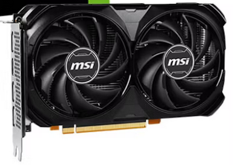

Partimos del supuesto de que debeis planificar la infraestructura *hardware* necesaria de una empresa dedicada al desarrollo de aplicaciones de inteligencia artificial específicas para clientes de diversos sectores. 

En este sprint nos centraremos en identificar y presupuestar los requerimientos de los equipos que se van a utilizar para crear aplicaciones de IA; desde los equipos de desarrollo (Standard Dev) hasta las estaciones de entrenamiento (Workstation AI). 

Para hacer una primera aproximación de los requerimientos vamos a basarnos en el **volumen de datos**, la **complejidad del modelo** y el **tiempo de entrenamiento** de una supuesta aplicación de clasificación de imágenes para identificar diferentes tipos de residuos (plástico, papel, vidrio, orgánico y otros) a partir de imágenes capturadas por cámaras en puntos de recogida.

- ***Dataset.*** Supongamos que queremos identificar las 5 categorías de residuos a partir de imágenes capturadas por cámaras HD en puntos de recogida. Para que sea fiable, necesitamos al menos 10.000 imágenes por categoría. Si cada imagen en HD ocupa unos 2 MB, el conjunto de datos estaría formado por 50.000 imágenes, lo que supone un tamaño total aproximado de 100 GB.   
- **RAM.** Aunque no carguemos las 100GB de golpe, el sistema operativo y las librerías de Python (como TensorFlow o Pandas) consumen mucha memoria. Podemos utilizar la fórmula:  
  `RAM (GB) = Tamaño del lote del dataset (GB) x 2 + Sistema operativo (GB)`  Esta fórmula es una aproximación orientativa.
- **Potencia de cálculo**. Las GPUs son esenciales para el entrenamiento de modelos de IA. Si debemos entrenar un modelo en un tiempo razonable (por ejemplo, menos de 5 horas), necesitaremos una GPU potente. Si nuestra GPU potente tarda 3 minutos en realizar una época de entrenamiento y necesitamos 100 épocas, el tiempo total de entrenamiento sería de 300 minutos (5 horas). En el otro extremo, si tenemos una GPU básica que tarda 60 minutos por época, el tiempo total sería de 6000 minutos (100 horas).
- **VRAM.**  El tamaño de memoria de la GPU (VRAM) debe ser al menos igual al tamaño del lote del dataset. En la VRAM se almacenan también los modelos y los cálculos intermedios. Si el modelo estándar utilizado para el reconocimiento de imágenes (YOLOv8 Large) ocupa unos 1.2GB y los cálculos intermedios (gradientes y optimizador) ocupan aproximadamente el doble del tamaño del lote, podemos usar la fórmula:  
  `VRAM (GB) = Tamaño del lote del dataset (GB) + Tamaño del modelo (GB) + Cálculos intermedios (GB)`   
- **Fuente de alimentación**. Necesitamos una fuente de alimentación que pueda suministrar suficiente potencia para todos los componentes del sistema. Si el consumo pico del sistema (CPU+GPU) es de 700W, se debería añadir +30% de margen de seguridad, por lo que la fuente debería ser de al menos 910W.

## 1. CPUs

Al analizar un procesador (CPU), hay varios factores clave que debes tener en cuenta para comprender su rendimiento y cómo se adapta a tus necesidades.

### 1.1. Arquitectura del Procesador

Como introdujimos en el sprint anterior, la arquitectura del procesador se refiere al diseño y la estructura interna del CPU.

Las arquitectura más conocida por el usuario son x86 (Intel y AMD) y ARM (ampliamente utilizado en dispositivos móviles, desde 2020, *Apple* ha empezado a utilizar sus propios procesadores basados en ARM para sus portátiles, la serie M (M1, M2, ...))

#### Arquitectura x86

- **Diseño CISC** (Complex Instruction Set Computing): Esta arquitectura se caracteriza por un conjunto de instrucciones complejo, lo que permite ejecutar operaciones multifacéticas en una sola instrucción.
- Fabricantes principales: **Intel** y **AMD** son los desarrolladores más destacados de procesadores x86.
- Dispositivos comunes: Predominantemente utilizada en ordenadores de escritorio, portátiles y servidores, donde el rendimiento y la compatibilidad son primordiales.

#### Arquitectura ARM

- **Diseño RISC** (Reduced Instruction Set Computing): Se enfoca en un conjunto de instrucciones más simple y eficiente, optimizando el consumo energético y el rendimiento por vatio.
- Fabricantes principales: ARM Holdings licencia su arquitectura a diversos fabricantes, entre ellos **Qualcomm**, **Apple**, **Samsung** y **NVIDIA**.
- Dispositivos comunes: Ampliamente implementada en dispositivos móviles como smartphones y tabletas, así como en sistemas embebidos y, más recientemente, en algunos portátiles y servidores debido a su eficiencia energética.

#### Diferencias claves

- Eficiencia energética: Los procesadores ARM suelen consumir menos energía, lo que los hace ideales para dispositivos móviles y aplicaciones donde la duración de la batería es crucial.  
- Rendimiento: Los procesadores x86 ofrecen un alto rendimiento y son compatibles con una amplia gama de aplicaciones de escritorio y servidor.   
- Compatibilidad de software: La arquitectura x86 tiene una larga trayectoria en el mercado de PC, lo que garantiza una amplia compatibilidad con software existente. ARM está ganando terreno, especialmente con sistemas operativos y aplicaciones diseñadas específicamente para su arquitectura.   

### 1.2. Frecuencia de reloj

La frecuencia de los procesadores se mide en gigahercios (GHz), que representan miles de millones de ciclos por segundo. Un procesador de 3.5 GHz, por ejemplo, ejecuta 3,500 millones de ciclos cada segundo.

Cuanto mayor es la frecuencia en GHz, más rápido puede ejecutar operaciones, aunque esto no siempre implica mayor rendimiento general (depende de otros factores como la arquitectura del procesador y la eficiencia energética).

### 1.3. Número de núcleos (*Cores*)

Un núcleo es una unidad de procesamiento independiente dentro del procesador. Cuantos más núcleos tenga un procesador, más tareas puede manejar simultáneamente. Procesadores con múltiples núcleos (dual-core, quad-core, octa-core, etc.) son mejores para multitarea y aplicaciones que requieren procesamiento paralelo.

!!! warning "Importante"

    Con el lanzamiento de los procesadores Intel Core de 12ª Generación (*Alder Lake*), Intel dio un gran paso adelante en esta filosofía, presentando dos tipos diferentes de núcleos dentro de un mismo procesador.

    - Los **P-Cores** se llaman así porque la P viene de Performance, rendimiento en inglés.   
    - Los **E-Cores** se llaman así porque la E viene de Efficiency, eficiencia en inglés.  
    - **LP E-Core**, que sería un núcleo de ultra-bajo consumo.   

    Actualmente, Intel está en la 14ª generación de procesadores, conocida como **Raptor Lake Refresh**, con hasta 24 nucleos (8 P-Cores + 16 E-Cores).

    Intel también tiene otras líneas de procesadores, como los procesadores Intel Xeon para servidores y estaciones de trabajo.  Sin embargo, la línea **Intel Core** es la más conocida y utilizada en ordenadores de sobremesa y portátiles.

### 1.4. Número de Hilos (Threads)

Los hilos son las unidades más pequeñas que gestionan las tareas dentro de un núcleo. Algunos procesadores tienen tecnología de multithreading (como *Hyper-Threading de Intel*) que permite a un núcleo manejar más de un hilo simultáneamente.

Más hilos permiten un mejor rendimiento en aplicaciones multitarea y tareas que se benefician del paralelismo, como edición de video o renderizado 3D.

**Solo los P-core tienen hilos**

### 1.5. Memoria Caché

La caché es una memoria muy rápida integrada en la CPU para almacenar datos e instrucciones de uso frecuente.
Tipos:

- **L1**: Pequeña y ultrarrápida, cercana a los núcleos.
- **L2**: Un poco más grande y más lenta que L1.
- **L3**: Compartida entre todos los núcleos, más lenta pero de mayor capacidad.

La caché ayuda a acelerar el acceso a datos y reduce la necesidad de ir a la RAM para obtener información, mejorando el rendimiento general.

{.center width=60%}

### 1.6. Proceso de fabricación (*nm*)

Se refiere al tamaño de los transistores en el procesador, medido en nanómetros (nm). Cuanto menor sea el tamaño, más transistores caben en el chip, lo que permite aumentar la eficiencia energética y el rendimiento.

Los procesadores actuales suelen estar por debajo de 10nm. Intel y AMD utilizan tecnologías de 7nm y 5nm en sus procesadores más recientes.

### 1.7. TDP (Thermal Design Power)

Medida en vatios, indica la cantidad de calor que el procesador disipa bajo carga máxima.
Un TDP más alto implica mayor consumo de energía y la necesidad de mejores soluciones de refrigeración. Es relevante para saber qué tipo de sistema de refrigeración necesitarás.

### 1.8. Compatibilidad con Memoria RAM

Los procesadores están diseñados para trabajar con ciertos tipos y velocidades de memoria RAM (por ejemplo, DDR4, DDR5).
Cuanto más rápida y avanzada sea la memoria RAM que soporta, mejor será el rendimiento en tareas intensivas en memoria.

### 1.9. GPU Integrada

La mayoría de los procesadores modernos incluyen una GPU integrada, que es útil para tareas gráficas básicas sin necesidad de una tarjeta gráfica dedicada.

!!! question "A201(CE2, CE5) Características de CPUs"

    Atendiendo a la información anterior, obtén las características del procesador de tu ordenador de clase, y comparalo con:

     Característica             | AMD Ryzen 9 7945HX | Intel Core i9-13900K |  Ryzen 9 9950X| Core i9-14900K | Apple M2 Ultra| Snapdragon X Elite (X1E-84-100)|
    |----------------------------|-------------------|-----------------------|--------------------|----------------------|--|--|
    | **Arquitectura**          |                   |                       |                    |                      |  |  |
    | **Frecuencia reloj base**  |                   |                       |                    |                      |  |  |
    | **Frecuencia turbo**       |                   |                       |                    |                      |  |  |  
    | **Número de núcleos por tipo**      |                   |                       |                    |                      |  |  |  
    | **Hilos**                  |                   |                       |                    |                      |  |  |  
    | **Caché**                  |                   |                       |                    |                      |  |  |  
    | **Tecnología fabricación** |                   |                       |                    |                      |  |  |  
    | **TDP**                    |                   |                       |                    |                      |  |  |  
    | **Desktop/Mobile**          |                   |                       |                    |                      |  |  |  
    | **Compatibilidad RAM**     |                   |                       |                    |                      |  |  |  
    | **GPU**                    |                   |                       |                    |                      |  |  |  
    | **Otra información**       |                   |                       |                    |                      |  |  |  

    Puedes hacer uso de los siguientes enlaces:

    - [Intel](https://www.intel.la/content/www/xl/es/products/details/processors.html)
    - [AMD](https://www.amd.com/es/products/specifications/processors.html)
    - [Intel+AMD](https://www.techpowerup.com/cpu-specs/)
    - [Apple+Qualcomm](https://www.notebookcheck.net/)
    - [Apple](https://www.apple.com/es/newsroom/2023/06/apple-introduces-m2-ultra/)
    - [Qualcomm](https://www.qualcomm.com/laptops/products/snapdragon-x-elite)

!!! note "Evolución Procesadores ¿Hegemonía Intel?"

    Durante décadas, Intel dominó el mercado de procesadores para ordenadores personales con su arquitectura x86. Sin embargo, en los últimos años, AMD ha ganado terreno significativo con sus procesadores Ryzen, ofreciendo un rendimiento competitivo y a menudo superior a precios más bajos.

    Además, la creciente adopción de arquitecturas ARM en dispositivos móviles y portátiles ha desafiado aún más la hegemonía de Intel. Apple, con su transición a los procesadores M1 y M2 basados en ARM, ha demostrado que es posible ofrecer un rendimiento excepcional y eficiencia energética sin depender de Intel.

    En resumen, aunque Intel sigue siendo un jugador importante en el mercado de procesadores, la competencia de AMD y la creciente popularidad de ARM han diversificado el panorama, ofreciendo a los consumidores más opciones y fomentando la innovación en la industria.

    Visualiza el [siguiente video](https://www.youtube.com/watch?v=Ae7VkdVwBRs&t=1673s) y responde a las preguntas:

    - ¿Cómo se denomina la última generación de procesadores de Intel? ¿En que versiones se divide?
    - En la nomenclatura de los procesadores de sobremesa de Intel de la serie 200, ¿qué significa la letra 'K' al final del nombre de un modelo?
    - En portátiles, el mismo número de modelo de Intel, como el Ultra 7 265, puede tener diferentes versiones (HX, H, U). ¿Qué diferencia principal existe entre un Ultra 7 265H y un Ultra 7 265U?
    - ¿Qué tienen de especial los procesadores Intel que terminan en 'V', conocidos como Lunar Lake?
    - ¿En qué área específica se menciona que AMD es el 'líder indiscutible' a día de hoy?
    - ¿Cómo se denomina los procesadores de Qualcomm para portátiles Windows?

!!! note "Evolución de procesadores (2ºparte)"

    Continúa visualizando el [siguiente video](https://youtu.be/aYR80xV_raA?si=1YtHKU_p8Irp95Bc) y responde a las preguntas:

    - ¿Qué ventaja ofrece AMD con su arquitectura de chiplets en comparación con Intel?
    - ¿En qué situaciones de uso personal sería más sostenible y eficiente elegir una APU en lugar de una combinación de CPU + GPU dedicada?
    - ¿qué indican el primer número (9) y las terminaciones como "X" o "X3D"?
    - ¿Cómo soluciona este diseño físico (soldar memoria en vertical) el problema de la latencia en el gaming y por qué se considera una "jugada maestra" frente a la arquitectura de Intel?
    - ¿Qué son las NPUs? ¿Qué opinión tiene el ponente sobre su utilidad?

## 2. GPUs dedicadas

La GPU (**Graphics Processing Unit**) es el procesador dedicado a manejar y acelerar tareas gráficas, como el procesamiento de imágenes, videos y gráficos 3D. Aunque su función principal es renderizar gráficos, también se utiliza en otros tipos de procesamiento paralelo intensivo, como inteligencia artificial y computación científica.

{.center width=60%}

{.center width=60%}

### 2.1. ¿Qué hay dentro de una GPU?

Destacamos los siguientes elementos principales:

- **GPU** (Graphics Processing Unit): Es el "cerebro" de la tarjeta gráfica. Se encarga de procesar todos los datos visuales y realizar cálculos complejos para generar imágenes en la pantalla.   
    En la actualidad, los fabricantes de chips gráficos más importantes son **NVIDIA** y **AMD**. Pero existen otras marcas que ensamblan estos chips en sus propias tarjetas gráficas, como **ASUS**, **MSI** o **Gigabyte**, añadiendo sus propios ventiladores y diseño.   
 
- **Memoria de Video VRAM**: Es la memoria específica de la tarjeta gráfica. Almacena datos temporales que la GPU necesita para renderizar imágenes rápidamente. Cuanta más memoria tenga la tarjeta gráfica, mejor podrá manejar gráficos complejos y texturas de alta resolución.
- **Sistema de refrigeración**: Las tarjetas gráficas generan mucho calor durante su funcionamiento, por lo que suelen incluir ventiladores y disipadores de calor para mantener una temperatura adecuada y evitar el sobrecalentamiento.
- **Conectores de salida**: Permiten conectar la tarjeta gráfica al monitor. Los tipos más comunes son VGA, HDMI, DisplayPort y DVI. La mayoría de las tarjetas de gráficas modernas utilizan **HDMI y DisplayPort** debido a su capacidad para manejar resoluciones y tasas de refresco más altas. Además algunas tarjetas gráficas pueden tener múltiples conectores para soportar varios monitores simultáneamente.

{.center width=80%}

### 2.2. Características clave de una GPU

- **Precio**. Es necesario tener en cuenta el presupuesto disponible y el rendimiento que se necesita.
- **VRAM (Video RAM)**. La cantidad de memoria dedicada a la tarjeta gráfica. Más VRAM permite manejar texturas y modelos más complejos, especialmente en juegos y aplicaciones de diseño gráfico.   
  La memoría gráfica actual para el mercado de consumo y workstations suele ser de tipo **GDDR** (Graphics Double Data Rate). Versión de memoria DDR optimizada para tarjetas gráficas, optimizando el ancho de banda en vez de la latencia como en la RAM de un ordenador. Las versiones más comunes son GDDR6 y GDDR7.   
  Tenemos un segundo de tipo de memoria gráfica llamada **HBM** (High Bandwidth Memory), que se utiliza en tarjetas gráficas de gama alta y estaciones de trabajo profesionales. La HBM ofrece un ancho de banda mucho mayor que la GDDR, lo que mejora significativamente el rendimiento en aplicaciones intensivas en datos.
- **Rendimiento** . Se mide en términos de velocidad de procesamiento, capacidad de renderizado y eficiencia energética. Si el objetivo de la tarjeta gráfica es el gaming, normalmente se mide en **FPS** (Frames Per Second). En aplicaciones profesionales, se mide en términos de **FLOPS** (Floating Point Operations Per Second).
-  **CUDA Cores**, **Tensor Cores** y **Ray Tracing Cores**: Estos núcleos ejecutan todos los cálculos de la GPU y cada uno tiene una función diferente.
- **Consumo energético**: El consumo energético de la tarjeta gráfica es importante.

Recursos:

- [Guía definitiva para elegir una GPU para IA](https://youtu.be/xJUp9K8es4U?si=DZI7WwS9yEzK-aHj)
- [NVidia RTX 5000](https://www.youtube.com/watch?v=49NBSEMyEzU)
- [Mejores tarjetas gráficas para Gaming 2026](https://youtu.be/emjC_cyev48?si=iT0G-FcejQ2xuGGR)
- [La IA se está comiendo la RAM del mundo](https://youtu.be/BEG9dTpqNO4?si=t0qYU6ZwR2NiYT3r)
- [Comparación entre Ada, Blackwell, GeForce y RTX Pro](https://youtu.be/khH2dCs0cM4?si=qltMv6AlLodh7Z9g)
- [Choosing a NVIDIA GPU for Deep Learning and GenAI in 2025: Ada, Blackwell, GeForce, RTX Pro Compared](https://youtu.be/khH2dCs0cM4?si=r6c1Z0w9xZqHJ5iJ)

!!! question "A202(CE2, CE5) GPUs para IA"

    Completar la matriz de especificaciones para evaluar el rendimiento y el coste  de cinco GPUs líderes en el mercado actual.

    | Características / Especificaciones | RTX 6000 Blackwell | RTX 6000 ADA | RTX 5090 | RTX 4070 Ti Super | AMD RX 7900 XTX |
    |----------------------------------|-------------------|-------------|---------|------------------|----------------|
    | Arquitectura                     |                   |             |         |                  |                |
    | Memoria VRAM (GB)                |                   |             |         |                  |                |
    | Rendimiento (AI TOPS)            |                   |             |         |                  |                |
    | Consumo (TDP Watts)              |                   |             |         |                  |                |
    | Conectores de salida             |                   |             |         |                  |                |
    | Precio Estimado (2026)           |                   |             |         |                  |                |
    | Propósito Principal              |                   |             |         |                  |                |

## 3. Placas base

La placa base es un circuito impreso con distintas formas estándar, que permiten que el resto de los componentes se conecten entre ellos. Es el **componente principal de un ordenador**, ya que todos los demás componentes se conectan a ella.

{.center width=60%}

### 3.1. Características y Componentes Generales

{.center width=80%}

- **Socket de CPU**: Es el conector donde se instala el procesador. El tipo de socket debe ser compatible con el procesador que se va a utilizar.   
  Intel y AMD diseñan sus procesadores para ser compatibles con un tipo de placa bás y un socket concreto. Los procesadores AMD actuales cuentan con la serie de socket **AM4 y AM5** (PGA), mientras que Intel es compatible con los socket LGA1200 y LGA1700.   
    + LGA (Land Grid Array) es un tipo de socket en el que los pines están en la placa base y el procesador tiene contactos planos.    
    + PGA (Pin Grid Array) es un tipo de socket en el que los pines están en el procesador y la placa base tiene contactos planos.

- **Chipset**: Chips de la placa base que gestionan la comunicación entre el procesador, la memoria RAM, las unidades de almacenamiento y otros periféricos. El chipset determina qué características y tecnologías son compatibles con la placa base.

- **Ranuras PCIe**: Son ranuras de expansión que permiten conectar tarjetas adicionales, como tarjetas gráficas, tarjetas de sonido o tarjetas de red. Para aplicaciones de IA es recomendable PCIe 5.0 (2026) para maximizar el ancho de banda entre la GPU y la CPU.

- **Conectores de memoria RAM**: Son ranuras donde se instalan los módulos de memoria RAM. La cantidad y tipo de ranuras determinan la capacidad máxima y el tipo de memoria que se puede utilizar. Para equipos de IA es recomendable DDR5 con altas frecuencias (6000 MHz o más) y soporte para grandes cantidades de memoria.

- **Conectividad y almacenamiento**: Presencia de ranurasM.2 NVMe para unidades de estado sólido (SSD) rápidas, puertos SATA para discos duros y SSDs adicionales, y puertos USB de alta velocidad (Thunderbolt 5 o USB 4).

- **VRM (Módulos de regulación de voltaje)**: Son componentes que regulan el voltaje suministrado al procesador y otros componentes. Un buen VRM es crucial para la estabilidad y el rendimiento del sistema, especialmente en configuraciones de alta gama.

Recurso:

- [No compres una placa base sin ver este video. Guía 2025 &2026](https://youtu.be/W7XsGOx_RPA?si=ci1NrYVi21Jz3L9V)
- [PC Profesional con 192gb de RAM, RTX5090 y plataforma TRX50 | Montaje Threadripper](https://www.youtube.com/watch?v=ZWtmG1S3IEU)

## 4. Memoria RAM

La memoria RAM (**Random Access Memory**) es una memoria de acceso rápido y volátil que almacena temporalmente datos e instrucciones que el procesador necesita mientras se ejecutan programas o aplicaciones.

El **factor de forma** de la RAM DDR se refiere a su tamaño físico y disposición de pines, siendo comúnmente **DIMM** (Dual In-line Memory Module) para ordenadores de sobremesa y **SO-DIMM** (Small Outline DIMM) para portátiles y dispositivos compactos.

{.center width=60%}

### 4.1. Tipos de RAM

En la actualidad, los tipos más comunes de memoria RAM son DDR4 y DDR5.

| Característica            | RAM DDR4                         | RAM DDR5                                  |
|---------------------------|----------------------------------|--------------------------------------------|
| Velocidad de Datos        | 1600 – 3200 MT/s (Típico)         | 4800 – 8400+ MT/s                          |
| Voltaje                   | 1.2 V                            | 1.1 V (Más eficiente)                     |
| Capacidad Máxima          | Hasta 32 GB por módulo           | Hasta 128 GB por módulo                   |

Dentro de un mismo tipo de RAM, existen diferentes **frecuencias** (medidas en MHz) y **latencias** (medidas en CL - CAS Latency). Una mayor frecuencia y una menor latencia generalmente se traducen en un mejor rendimiento.

- **Frecuencia (MT/s o MHz)**: A mayor número, más rápido se mueven los datos. Normalmente es recomendable fijarse en los MT/s (Mega Transfers per second) en lugar de MHz, ya que los MT/s reflejan mejor el rendimiento real de la RAN, ya que indica cuantas operaciones de envío/recepción se realizan realmente por segundo. Para equipos de IA se recomienda DDR5-6000 MT/s o superior.

- **Latencia CAS (CL)**: Es el tiempo de respuesta. Se expresa como "CL" seguido de un número (ej. CL30). **A menor número, mejor**. Una DDR5 con CL30 es mucho más rápida que una CL40 a la misma frecuencia.   
Suele haber confusión al comparar las latencias entre DDR4 y DDR5, ya que las DDR5 suelen tener latencias más altas (CL40 o CL50) en comparación con las DDR4 (CL16 o CL18). Sin embargo, debido a la mayor frecuencia y otras mejoras arquitectónicas de la DDR5, el rendimiento general suele ser superior a pesar de la latencia más alta.   

| Tipo de RAM              | Latencia CAS | Velocidad   | Latencia Real (ns) |
|--------------------------|--------------|-------------|--------------------|
| DDR4 (Estándar)          | CL16         | 3200 MT/s   | 10 ns              |
| DDR5 (Sweet Spot)        | CL30         | 6000 MT/s   | 10 ns              |
| DDR5 (Alta Gama)         | CL32         | 7200 MT/s   | 8.8 ns             |

- **Perfiles de Overclock (XMP/EXPO)**: Muchos módulos de RAM vienen con perfiles predefinidos para overclocking, conocidos como XMP (Extreme Memory Profile) para Intel y EXPO (Extended Profiles for Overclocking) para AMD. Estos perfiles permiten configurar la RAM a velocidades y latencias más altas de forma sencilla a través de la BIOS.

- **Fabricantes de Chips**: Aunque la marca sea Corsair o Kingston, los chips internos los fabrican **Samsung**, **SK Hynix** o **Micron**. 

Recursos:

- [Memoria RAM ¿Cuál elijo?](https://youtu.be/fmIHBW__F_M?si=TkSEj3SldTiQAwnS)

## 5. Almacenamiento secundario
