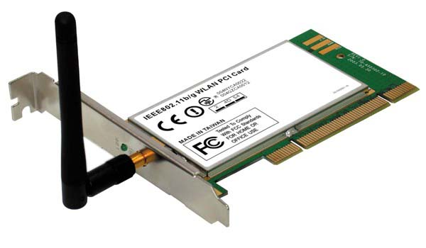
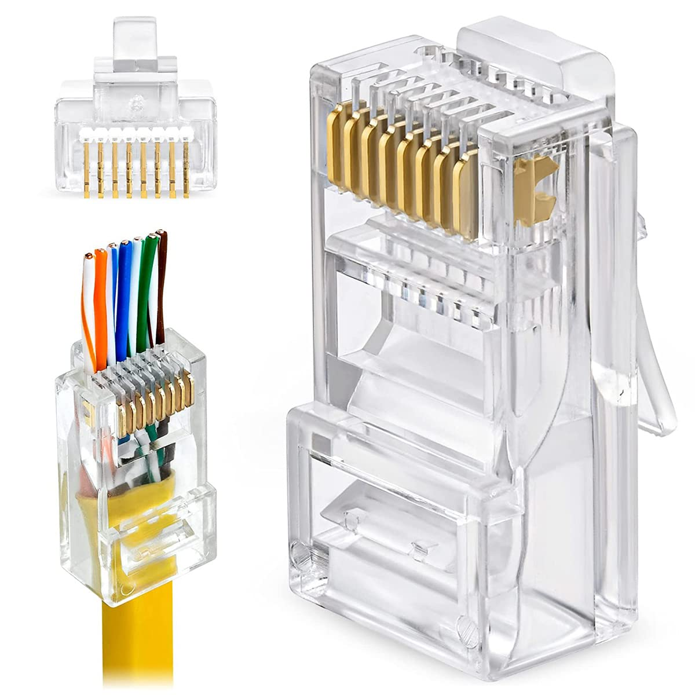
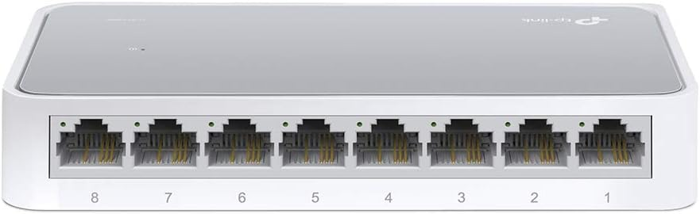
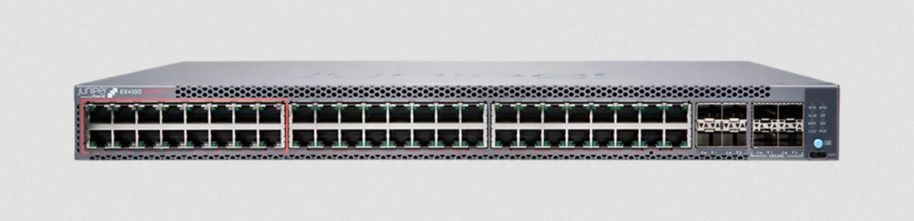
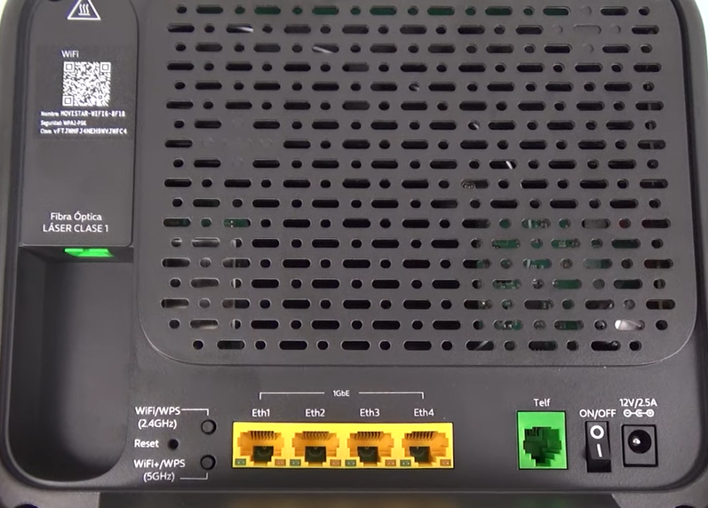
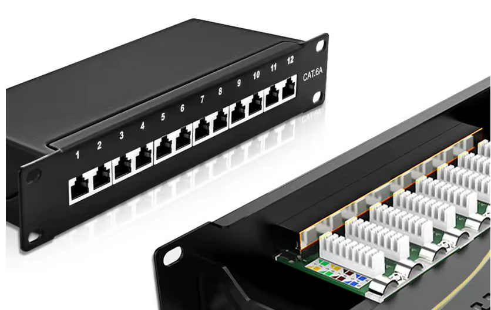

En este sprint presentaremos los protocolos de comunicación que permiten la interconexión en Internet y que constituyen la base de la mayoría de las redes locales. Comprender el funcionamiento de la **pila TCP/IP** es fundamental para ser capaces de analizar las características de las redes existentes y conectarlas de manera segura. Estos conocimientos nos permitirán diseñar y configurar el direccionamiento lógico y la infraestructura de red de la situación de aprendizaje anterior, así como desplegar los servicios en red necesarios para el funcionamiento de nuestra empresa de IA.

## 1. Protocolo TCP/IP

{.center width="60%"}

[Fuente:ccnadesdesdecero.com](https://ccnadesdecero.es/que-es-tcp-ip/)

El **modelo TCP/IP** es un conjunto de protocolos de comunicación que se utilizan para interconectar dispositivos en Internet. Este modelo se compone de cuatro capas: la capa de aplicación, la capa de transporte, la capa de Internet y la capa de interfaz de red. Cada capa tiene funciones específicas y protocolos asociados que permiten la comunicación entre dispositivos.

**Internet es un conjunto de redes interconectadas y hetereogeneas**, lo que significa que cada red puede tener su propia arquitectura y protocolos de comunicación. **El éxito del modelo TCP/IP radicó en su capacidad de homogeneizar la comunicación** entre estas redes, permitiendo que dispositivos alojados en redes con arquitecturas diferentes pudieran comunicarse entre sí.

### 1.1 Capa de interfaz de red

Es la capa más baja del modelo TCP/IP y se encarga de la transmisión de datos a través de la red física. Estrictamente hablando, esta capa no forma parte del modelo TCP/IP, ya que contiene las características específicas de cada red física.

En el caso de las redes locales, el protocolo más comúnmente utilizado en esta capa es el **Ethernet**, que define el formato de los paquetes de datos y las reglas para su transmisión a través de la red. 

El direccionamiento de los equipos que forman parte de la red local se realiza mediante **direcciones MAC**, que son identificadores únicos asignados a cada dispositivo por el fabricante. Estas direcciones se utilizan para dirigir los paquetes de datos a su destino dentro de la red local.

Esta dirección es un identificador de 48 bits que se asigna a cada dispositivo de red y se utiliza para la comunicación a nivel de enlace de datos dentro de la red local.

La dirección MAC se representa comúnmente en formato hexadecimal, dividida en seis grupos de dos dígitos separados por dos puntos (por ejemplo, `00:1A:2B:3C:4D:5E`). Las primeras tres partes de la dirección MAC identifican al fabricante del dispositivo, mientras que las últimas tres partes son un identificador único asignado por el fabricante.

No existe en el mundo dos tarjetas de red con la misma dirección MAC, lo que garantiza que cada dispositivo en una red local pueda ser identificado de manera única.

Para entender mejor la diferencia entre la dirección MAC y la dirección IP, podemos decir que la dirección MAC es como el número de bastidor de un coche, que es único para cada vehículo, mientras que la dirección IP es como la matrícula del coche, que puede cambiar dependiendo de dónde se encuentre el vehículo.

### 1.2 Capa de Internet

El protocolo más importante en esta capa es el **Protocolo de Internet (IP)**, que se encarga de la dirección y el enrutamiento de los paquetes de datos a través de la red. **El protocolo IP utiliza direcciones IP** para identificar los dispositivos en la red y dirigir los paquetes de datos a su destino.

La comunicación entre dispositivos de distintas redes se realiza por medio de un proceso llamado **[encapsulación](https://www.youtube.com/watch?v=7yeC5ohURAg)**, en el que los datos se envían a través de la red local utilizando direcciones MAC, y luego se encapsulan en paquetes IP para ser enviados a través de Internet.

#### 1.2.1 Estructura de una dirección IP

!!! info ""

    La dirección IP es el identificador de cada host dentro de su red de redes. Cada host conectado a una red tiene una
    dirección IP asignada, la cual debe ser distinta a todas las demás direcciones que estén vigentes en ese momento en
    el conjunto de redes visibles por el host. **En el caso de Internet, no puede haber dos ordenadores con 2 direcciones IP
    (públicas) iguales**. Pero **sí podríamos tener dos ordenadores con la misma dirección IP siempre y cuando pertenezcan
    a redes privadas independientes entre sí** (sin ningún camino posible que las comunique)

Las **direcciones IP están formadas por 4 bytes (32 bits)**. Se suelen representar de la forma `a.b.c.d` donde cada una de
estas letras representa un byte (8 bits) y su valor puede ir de `0` a `255`.

Se clasifican en clases (A, B, C, D y E) según el rango de direcciones que abarcan. Las clases A, B y C son las utilizadas para redes privadas y públicas.

Para identificar a qué clase pertenece una IP, nos debemos fijar en que los primeros bits del primer byte.

{.center width=80%}

!!! task "Direccionamiento IP"

    1. Identifica la clase a la que pertenecen las siguientes direcciones IP:

        a. 12.168.14.255   
        b. 80.58.12.68    
        c. 172.67.14.92   
        d. 200.255.192.64   
        e. 190.72.90.0    

    2. Completa la siguiente tabla indicando el rango de direcciones IP disponibles para cada una de las clases A, B y C:

    | Clase   | Desde        | Hasta            |
    |---------|--------------|------------------|
    | Clase A |               |       |
    | Clase B |              |        |
    | Clase C |         |         |

#### 1.2.2 Identificador de red y de host

Todas las direcciones IP tienen dos partes diferenciadas: el identificador de red y el identificador de host. La
separación entre ambas partes viene dada por la **máscara de subred**. La máscara de subred es una dirección IP que indica qué parte de la dirección IP corresponde a la red y qué parte corresponde al host.

!!! info ""

    Por cada dirección IP, existen dos partes diferenciadas:

    - **Identificador de red**: Permite identificar a la red a la que pertenece el dispositivo.
    - **Identificador de host**: Permite identificar al dispositivo dentro de la red.

La máscara de red se representa de la misma forma que una dirección IP, es decir, con 4 bytes separados por puntos. Los bits
de la máscara que están en `1` indican la parte de la dirección IP que corresponde a la red, mientras que los bits en `0` indican la parte que corresponde al host.

Normalmente, podemos encontrarla representada de dos formas:

- Notación decimal con puntos: `255.255.255.0` En este caso los primeros 3 bytes están en `1` y el último en `0`, por lo que los primeros 24 bits corresponden a la red y los últimos 8 bits al host.
- Notación CIDR (Classless Inter-Domain Routing): `/24` En este caso, el número indica la cantidad de bits que corresponden a la red. En este caso, los primeros 24 bits corresponden a la red y los últimos 8 bits al host.

!!! task "Identificador de red y host"

    Dadas las siguientes direcciones IP y sus respectivas máscaras, indica cuál es el identificador de red y cuál es el identificador de host:

    | # | Dirección IP        | Máscara de Red     | Identificador de Red (Net ID) | Identificador de Host (Host ID) |
    |---|---------------------|--------------------|-------------------------------|---------------------------------|
    | 1 | 192.168.1.15        | 255.255.255.0      |                               |                                 |
    | 2 | 10.0.0.42           | 255.0.0.0          |                               |                                 |
    | 3 | 172.16.5.100        | 255.255.0.0        |                               |                                 |
    | 4 | 192.168.100.2       | 255.255.255.0      |                               |                                 |
    | 5 | 8.8.8.8             | 255.0.0.0          |                               |                                 |
    | 6 | 172.31.0.1          | /16                |                               |                                 |
    | 7 | 192.168.0.254       | /24                |                               |                                 |
    | 8 | 10.25.50.75         | /8                 |                               |                                 |
    | 9 | 172.20.200.10       | /16                |                               |                                 |
    |10 | 192.0.2.1           | /24          |                               |                                 |

!!! note "Direccionamiento de equipos de red"

    Relaciona cada dirección IP con la red a la que pertenece. Habrá direcciones IP que no pertenezcan a ninguna de las redes indicadas, en cuyo caso habrá que obtener el identificador de red correspondiente. 

    | Columna A: Direcciones IP (Dispositivos) | Columna B: Identificadores de Red |
    |----------------------------------------|----------------------------------|
    | 1. 192.168.1.15 /24                    | A. 10.0.0.0 /8                  |
    | 2. 172.16.50.4 /16                     | B. 192.168.1.0 /24               |
    | 3. 10.1.1.100 /8                       | C. 172.16.0.0/16                 |
    | 4. 192.168.1.200 /16                   | D. 192.168.50.0 /24               |
    | 5. 172.16.1.25 /24                     | E. 172.20.0.0                 |
    | 6. 10.254.254.254 /16                  | F. 10.0.0.0 /16                |
    | 7. 192.168.1.45 /24                    |                                  |
    | 8. 172.16.100.1 /24                    |                                  |
    | 9. 10.0.0.5 

#### 1.2.3 Direcciones especiales

Existen ciertas direcciones IP que tienen un significado especial y no pueden ser asignadas a dispositivos en una red. Algunas de estas direcciones son:

- **Dirección de red**: Es la primera dirección de una red y se utiliza para identificar la red en sí misma. Por ejemplo, en la red `172.16.14.214/16`, la dirección de red es `172.16.0.0`. La parte de la IP que corresponde al host es `0`.
- **Dirección de broadcast**: Es la última dirección de una red y se utiliza para enviar mensajes a todos los dispositivos de la red. Por ejemplo, en la red `172.16.14.214/16`, la dirección de broadcast es `172.16.255.255`. La parte de la IP que corresponde al host es `255`.

!!! task "Número de equipos en una red"

    Obtén el número de equipos que se pueden direccionar en las siguientes redes. Recuerda que no se pueden utilizar la dirección de red ni la de broadcast. Por ejemplo, en la red `192.168.100.0` se puede direccionar a 254 equipos (256 - 2), desde la `192.168.100.1` hasta la `192.168.100.254`

    | Dirección IP / Prefijo | Identificador de red | Dirección broadcast | IP de inicio | IP final | Nº de hosts |
    |-----------------------|----------------------|---------------------|--------------|----------|-------------|
    | 192.168.1.15 /24      | 192.168.1.0          | 192.168.1.255       | 192.168.1.1  | 192.168.1.254 | 254 |
    | 172.16.50.4 /16       |                      |                     |               |         |  |
    | 10.1.1.100 /8         |                      |                     |               |         |  |
    | 192.168.1.200 /24     |                      |                     |               |         |  |
    | 172.16.0.25 /16       |                      |                     |               |         |  |
    | 10.254.254.254 /8     |                      |                     |               |         |  |
    | 192.168.1.45 /24      |                      |                     |               |         |  |
    | 172.16.100.1 /16      |                      |                     |               |         |  |
    | 10.0.0.5 /8           |                      |                     |               |         |  |
    | 192.168.1.1 /24       |                      |                     |               |         |  |
    /16                        |                                  |
        | 10. 192.168.2.1 /24                   |                                  |

### 1.2.4 Configuración entorno de red

Todos los entornos de red necesitan los siguientes parámetros para funcionar correctamente:

- **Dirección IP del dispositivo**.
- **Máscara de red**.
- **Puerta de enlace predeterminada**.
- **Servidores DNS (Domain Name System)**.

La **dirección IP y la máscara de red** permiten al dispositivo comunicarse con otros dispositivos. Si la configuración de estos parámetros es incorrecta, aunque el dispositivos esté físicamente conectado a la red, no podrá comunicarse con el resto de equipos.

La **Puerta de enlace o *Gateway*** se refiere a la IP del dispositivo de red que permite a la red local comunicarse con otras redes, como Internet. La puerta de enlace es el router que conecta la red local con el proveedor de servicios de Internet (ISP)

**Servidores DNS (Domain Name System)**. Los servidores DNS son los encargados de traducir los nombres de dominio (como www.ejemplo.com) en direcciones IP. Si no se configuran correctamente, el dispositivo no podrá resolver nombres de dominio y no podrá acceder a sitios web utilizando sus nombres. Existen servidores DNS públicos como los de Google (8.8.8.8 y 8.8.4.4).

Para direccionar redes locales, se utilizan direcciones **IP privadas**, que no se utilizan en Internet. Estas direcciones IP privadas pertenecen a los siguientes rangos:

- Clase A: `10.0.0.0/8`
- Clase B: `172.16.0.0/16` a `172.31.0.0/16`
- Clase C: `192.168.0.0/24`a `192.168.255.0/24`

!!! task "Direcciones IP privadas"

    Responde a las siguientes preguntas:

    1. ¿Cuántas redes privadas de cada clase existen? ¿Cuántos hosts se pueden direccionar en cada una de estas redes privadas?
    2. ¿Por cada una de las redes de clase A, cuántas redes de clase B y de clase C se pueden crear? ¿Cuántos hosts se pueden direccionar en cada una de estas redes?
    3. ¿Por cada una de las redes de clase B, cuántas redes de clase C se pueden crear? ¿Cuántos hosts se pueden direccionar en cada una de estas redes?

!!! task "A206(CE3)- Configuración de parámetros de red"

    Como Agentes Digitalizadores de empresas, debéremos asegurarnos de que los dispositivos de red estén correctamente configurados para garantizar una conectividad óptima.

    1. Suponiendo que cada miembro de vuestro equipo de trabajo tiene un PC, configura el entorno de red de cada uno de ellos en los siguientes casos (IP, Máscara de red, Puerta de enlace, Servidores DNS). En cada uno de los casos, la puerta de enlace será la última dirección IP utilizable de la red (por ejemplo, en la red `172.16.0.0/16`, la puerta de enlace sería `172.16.255.254`).

        a. `192.168.x.0/24` (donde `x` es el número de equipo del agente digitalizador, por ejemplo, si eres el agente 3, tus equipos estarán en la red 192.168.3.0/24)

        b. `172.16.x.0/16` (donde `x` es el número de equipo del agente digitalizador)

        c. `10.x.10.0/24` (donde `x` es el número de equipo del agente digitalizador e `y` vale 1 para el director de comunicación, 2 para el responsable de marketing y 3 para el responsable de ventas)
    
    2. Indica en cada uno de los casos anteriores, si la red de tu grupo sería visible desde la red de otro grupo. Justifica la respuesta.

## 2. Componentes de una Red de Área Local (LAN)

### 2.1 Equipos Terminales (Hosts)

Un equipo terminal de datos es cualquier dispositivo que se conecta a la red para enviar o recibir datos. Estos pueden ser computadoras de escritorio, laptops, impresoras, teléfonos inteligentes, tabletas, cámaras de seguridad, entre otros. Cada host en la red debe tener una dirección IP única para poder comunicarse con otros dispositivos en la red.

### 2.2 Tarjetas de Red (NIC - Network Interface Card)

Las tarjetas de red son componentes de hardware que **permiten a los dispositivos conectarse a una red**. Estas tarjetas pueden ser **integradas** en la placa base del dispositivo o pueden ser tarjetas de **expansión** que se instalan en una ranura de expansión. Las tarjetas de red pueden ser para conexiones **cableadas** (**Ethernet**) o **inalámbricas** (Wi-Fi).

{ .center width="50%" }

{ .center width="50%" }

#### 2.2.1 Direcciones físicas (MAC)

Cada tarjeta de red tiene una dirección física única llamada **dirección MAC (Media Access Control)**. Esta dirección es un identificador de 48 bits que se asigna a cada dispositivo de red y se utiliza para la comunicación a nivel de enlace de datos dentro de la red local.

La dirección MAC se representa comúnmente en formato hexadecimal, dividida en seis grupos de dos dígitos separados por dos puntos (por ejemplo, `00:1A:2B:3C:4D:5E`). Las **primeras tres partes de la dirección MAC identifican al fabricante del dispositivo**, mientras que **las últimas tres partes son un identificador único asignado por el fabricante**.

No existe en el mundo dos tarjetas de red con la misma dirección MAC, lo que garantiza que cada dispositivo en una red local pueda ser identificado de manera única. 

Para entender mejor la diferencia entre la dirección MAC y la dirección IP, podemos decir que la dirección MAC es como el número de bastidor de un coche, que es único para cada vehículo, mientras que la dirección IP es como la matrícula del coche, que puede cambiar dependiendo de dónde se encuentre el vehículo.

### 2.2.2. Conector RJ-45

Las tarjetas de red Ethernet utilizan un conector llamado **RJ-45** para conectarse a la red mediante **cables de par trenzado**. Este conector tiene **8 pines** que se utilizan para transmitir y recibir datos, así como para proporcionar alimentación eléctrica en algunos casos (**Power over Ethernet - PoE**) para dispositivos como cámaras de seguridad o puntos de acceso inalámbricos.

{ .center width="30%" }

### 2.2.3 Roseta de red

La **roseta de red rj45**, es el punto terminal de una conexión de red cableada en una pared o en un escritorio. Es el punto donde se conecta el cable de red que proviene del switch o del router para proporcionar conectividad a los dispositivos terminales.

{ .center width="30%" }

Normalmente, desde el switch hay un cable de red que va a cada una de las rosetas de red y desde la rosta se conecta al dispositivo terminal mediante un cable de red más corto, denominado **latiguillo**.

{ .center width="30%" }

### 2.2.4 Cable de par trenzado

El cable de par trenzado es el tipo de cable más comúnmente utilizado para **conectar dispositivos a una red Ethernet**. Está compuesto por **cuatro pares de cables** que están trenzados entre sí para reducir la interferencia electromagnética.

Los cables de par trenzado se pueden dividir en dos categorías principales: **UTP (Unshielded Twisted Pair)** y **STP (Shielded Twisted Pair)**. El cable UTP es el más comúnmente utilizado en redes de área local, mientras que el cable STP se utiliza en entornos con alta interferencia electromagnética, como en fábricas o cerca de equipos eléctricos.

Por cada una de las categorías anteriores, existen diferentes categorías de cables que se diferencian por su capacidad de transmisión de datos y su velocidad máxima. Por ejemplo, el cable **Cat5e** es capaz de transmitir datos a velocidades de hasta 1 Gbps, mientras que el cable **Cat6** puede transmitir datos a velocidades de hasta 10 Gbps.

En la cubierta del cable podemos encontrar información sobre su categoría, el tipo de cable (UTP o STP) y la velocidad máxima de transmisión de datos que soporta. Un cable de categoría 6 es más caro que un cable de categoría 5, y lógicamente un cable STP es más caro que un cable UTP.

{ .center width="50%" }

### 2.3 Equipos intermedios (Dispositivos de Interconexión)

Los dispositivos de interconexión son aquellos que **permiten la comunicación entre diferentes hosts** dentro de una red local o entre **diferentes redes**. 

#### 2.3.1 Conmutadores (Switches)

**Permite la comunicación entre equipos terminales dentro de una misma red local.**

Existen muchos tipos de conmutadores, desde los más básicos para uso doméstico.

{ .center width="30%" }

Hasta los más avanzados para uso empresarial, que ofrecen características adicionales.

{ .center width="50%" }

#### 2.3.2 Puntos de Acceso Inalámbricos

**Permiten la conexión de dispositivos inalámbricos a la red local.** Podriamos decir que un punto de acceso inalámbrico es como un conmutador, pero para dispositivos inalámbricos.

Una de las características más importantes que hay que entender sobre los puntos de acceso inalámbricos es que **no crean una nueva red inalámbrica**, sino que **extienden la red cableada existente**. Esto significa que los dispositivos inalámbricos conectados a un punto de acceso forman parte de la misma red local que los dispositivos cableados, lo que permite la comunicación entre todos los dispositivos sin importar si están conectados por cable o de forma inalámbrica. 

La ventaja de las redes inalámbricas con respecto a las cableadas es la movilidad que ofrecen, ya que los dispositivos pueden conectarse a la red desde cualquier lugar dentro del alcance del punto de acceso. Sin embargo, tienen algunas desventajas, como la menor velocidad de transmisión de datos, debido a que el medio de transmisión inalámbrico es compartido por todos los usuarios que están conectados al mismo punto de acceso, lo que puede generar congestión y reducir el rendimiento de la red.

Además, la velocidad efectiva de una red inalámbrica puede verse afectada por la saturación de otras redes inalámbricas cercanas. 

Por último, existen  diferentes estándares de redes inalámbricas, que podemos agrupar actualmente en dos grandes categorías, las redes Wi-Fi 5 (802.11ac) y las redes Wi-Fi 6 (802.11ax). 

| Característica               | Wi-Fi 5                  | Wi-Fi 6                  |
|------------------------------|--------------------------|--------------------------|
| Estándar IEEE               | IEEE 802.11ac           | IEEE 802.11ax           |
| Frecuencia                  | 5 GHz                   | 2,4 GHz y 5 GHz         |
| Velocidad teórica máxima    | Hasta 6,9 Gbps          | Hasta 9,6 Gbps          |

Las redes Wi-Fi 6 ofrecen una mayor velocidad de transmisión de datos, una mejor eficiencia en la gestión de múltiples dispositivos conectados al mismo punto de acceso. Sin embargo, para aprovechar las ventajas de las redes Wi-Fi 6, tanto el punto de acceso como los dispositivos conectados deben ser compatibles con este estándar.

Ejemplo de punto de acceso inalámbrico con antenas externas:

{ .center width="40%" }

Punto de acceso inalámbrico con antenas internas:

{ .center width="40%" }

#### 2.3.3 Enrutadores (Routers)

**Permiten la comunicación entre diferentes redes.** Un enrutador es un dispositivo de interconexión que se utiliza para conectar diferentes redes, como por ejemplo una red local (LAN) con una red de área amplia (WAN) como Internet.

Como hemos visto en el sprint anterior, los proveedores de servicios de Internet (ISP) suelen proporcionar un enrutador que se conecta a la red del cliente para permitir el acceso a Internet. Este elemento incluye en un único dispositivo las funciones de enrutamiento entre la red local e Internet, las funciones de conmutación por cable (*eth*) para conectar los dispositivos cableados a la red local, y las funciones de punto de acceso inalámbrico para conectar los dispositivos inalámbricos a la red local.

{ .center width="40%" }

### 2.4 Otros componentes

#### 2.4.1 Rack o Armario de Red

Un **Rack o Armario de Red** es una estructura física que alberga los dispositivos de red, como switches, routers, servidores, etc., en un entorno corporativo. Su propósito es organizar y proteger los equipos de red de forma eficiente y segura.

Suelen tener una anchura estándar de 19 pulgadas y pueden variar en altura.

{ .center width="40%" }

#### 2.4.2 Patch Panel

Un **Patch Panel** es un dispositivo que se utiliza para organizar y gestionar los cables de red en el interior de un Rack. Consiste en una placa con múltiples puertos donde se conectan los cables de red provenientes de las rosetas de red. Desde el Patch Panel, los cables se conectan a los dispositivos de red como switches o routers mediante **latiguillos**.

{ .center width="40%" }

!!! task "A207 (CE3) - Diseño esquema físico de red"

    Cada grupo tiene asignado un plano técnico de una supuesta oficina que se debe cablear. En este plano, deben diseñar el esquema físico de la red, indicando la ubicación de los dispositivos de red, los hosts y los medios de transmisión. 

    **El trabajo debe ser individual**. Sobre el plano técnico, deberás:

    - Ubicar el Hardware: Colocar iconos representativos de los dispositivos de red (Router, Switch, Puntos de Acceso Wi-Fi).

    - Trazado de Red: Dibujar el cableado estructurado siguiendo las paredes y canalizaciones del plano, diferenciando visualmente las conexiones por cable (Ethernet) de las inalámbricas. Se debe indicar claramente el recorrido del cableado, marcando el grosor de la línea para diferenciar el número de hosts conectados a cada segmento de cableado.

    Para que el diseño sea validado, cada plano individual debe contener, al menos, los siguientes elementos técnicos:

    - Router de salida: Punto de conexión con el proveedor de servicios de Internet (ISP).

    - Switch de red: Dispositivo central para interconectar los equipos mediante red cableada.

    - Punto de Acceso Inalámbrico: Para dar cobertura Wi-Fi a los dispositivos móviles de la empresa.

    - Cableado Estructurado: Representación visual de las líneas de datos (puedes usar colores diferentes para diferenciar cableado para distintas estancias o para diferenciar las conexiones Wifi).

    La herramienta de diseño es [draw-io](https://app.diagrams.net/), y los simbolos a utilizar pueden ser simples recuadros con texto interior o iconos representativos de cada dispositivo.

    En la parte inferior del plano técnico se debe incluir una referencia visual de los siguientes elementos:

    - **RACK**. Dimensiones, precio.
    - **Bobina cableado red**. Tipo, categoría, metros bobina, precio.
    - **Switch**. Marca y modelo. Número de puertos, velocidad, precio. Ojo. Es necesario que el switch tenga al menos el mismo número de puertos que el número de hosts cableados que se van a conectar a la red. Es común que siempre se adquiera un switch con más puertos de los necesarios para tener margen de crecimiento en la red.
    - **Punto de Acceso Wi-Fi**. Marca y modelo. Estándar Wi-Fi, velocidad máxima. Ojo, si el punto de acceso es de techo, no se puede adjuntar una imagen de un punto de acceso de sobremesa, ya que no es lo mismo. 
    - El router de salida no es necesario ya que se asume que el proveedor de servicios de Internet (ISP) lo proporcionará, pero se debe indicar su ubicación en el plano.

    Un ejemplo de esquéma físico de red podría ser el siguiente:

    { .center width="50%" }

!!! task "A208.1(CE1) - Diseño esquema lógico de red (**Cisco Packet Tracert**)"

    En esta **actividad individual**, deberás diseñar el esquema lógico de red asociado al esquema físico que has realizado en la actividad anterior. 

    1. En la **cabecera del documento**, se debe incluir una leyenda con el **identificador de red**, la **máscara de red** y la **puerta de enlace** predeterminada.
    2. En el diagrama de red, **se deben incluir los siguientes elementos**:
        - Nube de Internet(*Cloud-PT*).
        - Router *WRT300N* con su dirección IP local asignada.
        - *Switch 2960* de red.
        - Equipos terminales como puntos de acceso inalámbricos,equipos de escritorio, portátiles, impresoras, etc...
        - Se debe configurar por cada dispositivo su dirección IP asignada, su máscara de red, su puerta de enlace. Los equipos de sobremesa e impresoras deberán tener además un nombre de equipo asignado.
        
    3. Todos los equipos deben tener conectividad entre sí, es decir, deben poder hacer ping a todos los demás dispositivos de la red. Para ello, es necesario configurar correctamente el direccionamiento IP de cada dispositivo.

